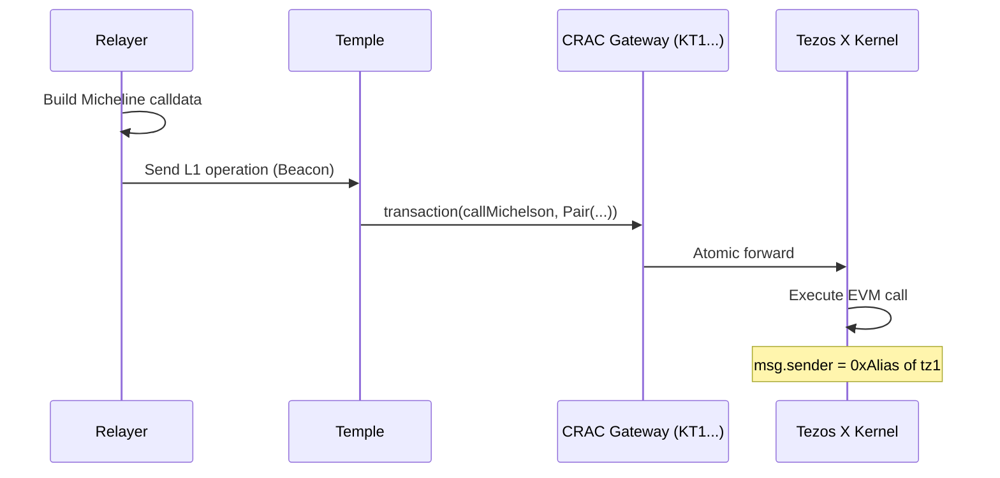

# CRAC Gateway

**CRAC** (Cross-Runtime Atomic Calls) is the Tezos X mechanism for atomically forwarding EVM transactions to the Tezos L1 Michelson layer.

## Entrypoints

| Context | Entrypoint | Use case |
|---|---|---|
| Native transfer (tez) | `default` | Send XTZ to a Tezos address |
| Smart contract call (EVM→Michelson) | `callMichelson` | Call a Michelson contract from EVM |
| Smart contract call (Michelson→EVM) | `call_evm` | Call an EVM contract from Michelson |

## Micheline structure

For a `callMichelson` call, the relayer builds:

```
Pair(
  destination_kt1,
  Pair(
    entrypoint_name,
    calldata_bytes
  )
)
```

## Flow



## Sender identity

When a transaction passes through CRAC:
- `Tezos.get_sender` inside a Michelson contract = **the user's mapped tz1 address**
- The kernel resolves the EVM caller's identity and forwards it as the sender to the Michelson contract

:::info
`Tezos.get_sender` returns the original caller's tz1 address (mapped from the EVM alias), not the CRAC gateway address.
:::
