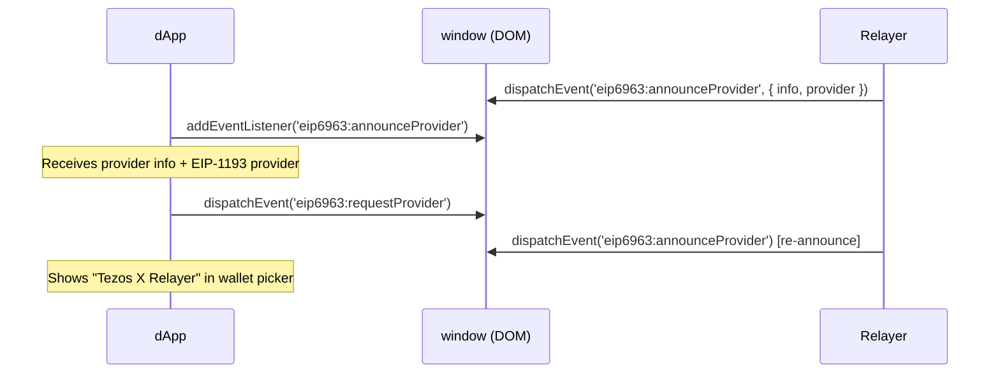

# EIP-6963 Multi-Wallet Discovery

[EIP-6963](https://eips.ethereum.org/EIPS/eip-6963) defines a standard for multiple wallet providers to coexist on a page without conflicting over `window.ethereum`.

## Why it matters

Modern dApps (using wagmi, RainbowKit, ConnectKit) no longer rely solely on `window.ethereum`. Instead, they listen for wallet announcements via DOM events. Without EIP-6963, the relayer would be invisible to these dApps.

## Announcement flow



## Provider info

```ts
// src/index.ts — the IIFE bundle
const info = {
  uuid: '6cfb5e8b-2b9a-4d9f-b8e1-1a2b3c4d5e6f',
  name: 'Tezos X Relayer',
  rdns: 'com.tezosx.relayer',
  icon: 'data:image/png;base64,...', // base64 PNG data URI, inlined in the bundle
};
```

The superseded PoC extension announces the same `uuid` / `name` / `rdns` but
a different icon: a URL-encoded inline SVG
(`data:image/svg+xml,%3Csvg ...`), defined in `extension/src/injected.ts`.

## `window.ethereum` locking

Before announcing, the IIFE bundle pins `window.ethereum` with
`Object.defineProperty(window, 'ethereum', { value: provider, writable:
false, configurable: false })` so another extension cannot replace it later.
If the property was already locked by someone else (e.g. Temple got there
first), `defineProperty` throws and the code falls back to a plain
assignment; if `window.ethereum` was merely set, a console warning notes the
override before locking. Finally, the legacy `ethereum#initialized`
`CustomEvent` is dispatched for pre-6963 discovery paths (wagmi v1,
ethers.js).

## Two provider identities

Two distinct EIP-6963 identities exist in this repository — they can coexist
on a page and appear as separate entries in a wallet picker:

| Identity | `uuid` | `rdns` | Source |
|---|---|---|---|
| Tezos X Relayer (IIFE bundle and PoC extension) | `6cfb5e8b-2b9a-4d9f-b8e1-1a2b3c4d5e6f` | `com.tezosx.relayer` | `src/index.ts`, `extension/src/injected.ts` |
| Tezos X Wallet extension (name string `'TezosX Wallet'`) | `9a3f7c2e-5d8b-4c1a-a9f2-6e3b8d1c5a4f` | `com.tezosx.wallet` | `packages/wallet/src/injected/provider.ts` |

## Compatibility

| dApp stack | Detection method | Works |
|---|---|---|
| wagmi v2 + RainbowKit | EIP-6963 | ✅ |
| wagmi v1 | `window.ethereum` | ✅ |
| Privy | EIP-6963 | ⚠️ Detected — but the one Privy-based dApp tested (Hanji) did not complete the connection. See [dApp Compatibility](../user-flows/dapp-compatibility). |
| Raw `window.ethereum` | Direct access | ✅ |
