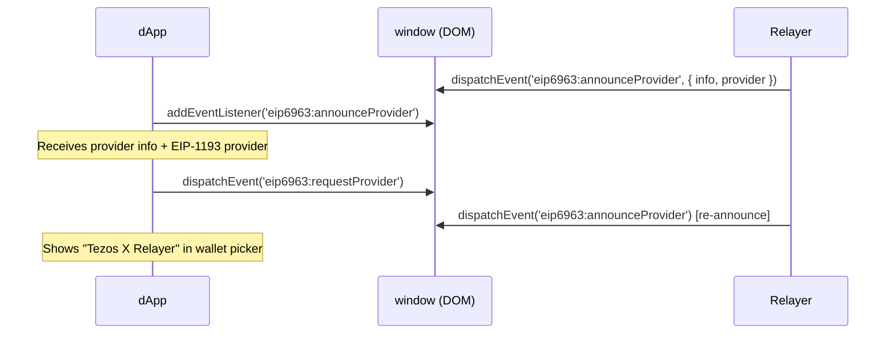

# EIP-6963 Multi-Wallet Discovery

[EIP-6963](https://eips.ethereum.org/EIPS/eip-6963) defines a standard for multiple wallet providers to coexist on a page without conflicting over `window.ethereum`.

## Why it matters

Modern dApps (using wagmi, RainbowKit, ConnectKit) no longer rely solely on `window.ethereum`. Instead, they listen for wallet announcements via DOM events. Without EIP-6963, the relayer would be invisible to these dApps.

## Announcement flow



## Provider info

```ts
const info = {
  uuid: '6cfb5e8b-2b9a-4d9f-b8e1-1a2b3c4d5e6f',
  name: 'Tezos X Relayer',
  rdns: 'com.tezosx.relayer',
  icon: 'data:image/png;base64,...', // tezos-logo.png
};
```

## Compatibility

| dApp stack | Detection method | Works |
|---|---|---|
| wagmi v2 + RainbowKit | EIP-6963 | ✅ |
| wagmi v1 | `window.ethereum` | ✅ |
| Privy (configured) | EIP-6963 | ✅ |
| Raw `window.ethereum` | Direct access | ✅ |
