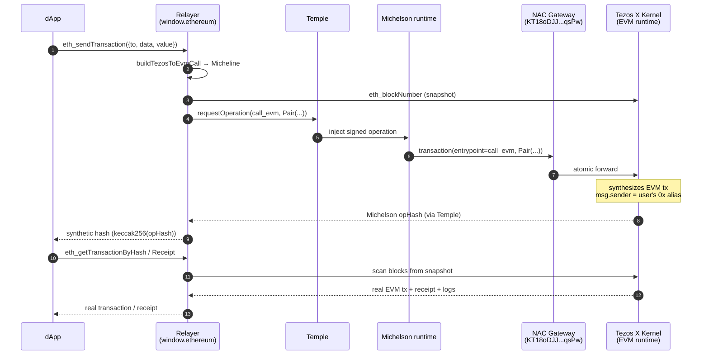

# NAC Gateway

**NAC** (Native Atomic Composability) is the Tezos X mechanism for routing
execution between the Michelson runtime and the Tezlink EVM runtime
within a single atomic operation.

## The two directions

NAC is bidirectional. Each direction uses a different surface:

| Direction | Surface | Used by |
|---|---|---|
| **EVM → Michelson** | NAC precompile at `0xff00000000000000000000000000000000000007`, via the EVM selectors `callMichelson(string,string,bytes)` (ABI calls) and the generic `call(string,(string,string)[],bytes,uint8)` (bare native transfers) | dApps running on the EVM runtime that want to invoke a Michelson contract or credit a tz1 — see [EVM entry point](../technical/evm-entry) |
| **Michelson → EVM** | NAC gateway contract `KT18oDJJKXMKhfE1bSuAPGp92pYcwVDiqsPw` on the Michelson runtime, entrypoints `call_evm` (ABI calls) and `%call` (bare native transfers) | **The relayer** — wraps every user EVM transaction as a Michelson op |

## What the relayer does

The relayer uses the **Michelson → EVM** direction. Temple can only sign Michelson runtime
operations, so instead of submitting an EVM transaction directly, the relayer
wraps the user's intent into a Michelson op targeting the NAC gateway. The Tezos X
kernel receives the op, synthesizes the corresponding EVM transaction, and
executes it with `msg.sender` set to the user's EVM alias.

The builder is the `buildTezosToEvmCall` use case (exported from
`@tezosx/relayer/tezos`). It picks the entrypoint by calldata:

- **Empty calldata** (bare native transfer) → gateway entrypoint **`call`**
- **Non-empty calldata** (contract call) → gateway entrypoint **`call_evm`**

## `call_evm` entrypoint signature

```
pair string (pair string (pair bytes (option (contract bytes))))
```

| Field | Type | Content |
|---|---|---|
| `destination` | `string` | The target EVM contract address (`0x...`) |
| `method_sig`  | `string` | The full text signature of the EVM function, e.g. `"transfer(address,uint256)"`. The kernel recomputes the 4-byte selector from this string. See [Selector resolution](#selector-resolution) below for how the relayer derives this from the ethers.js / viem calldata. |
| `calldata`    | `bytes`  | ABI-encoded parameters (no selector prefix — the kernel prepends it) |
| `callback`    | `option (contract bytes)` | Optional Michelson callback invoked by the kernel after the EVM call finishes. The relayer always passes `None` (the second argument of `buildTezosToEvmCall` is defaulted to `{ prim: 'None' }` and exposed for future use cases). |

## Micheline built by the relayer

For a non-empty calldata EVM transaction, `buildTezosToEvmCall` produces:

```json
{
  "prim": "Pair",
  "args": [
    { "string": "0xTargetEvmAddress" },
    { "prim": "Pair", "args": [
        { "string": "transfer(address,uint256)" },
        { "prim": "Pair", "args": [
            { "bytes": "abi-encoded-params-hex" },
            { "prim": "None" }
          ]
        }
      ]
    }
  ]
}
```

## Bare native transfers — the `%call` entrypoint

Bare transfers (empty calldata) go through the gateway's generic HTTP
**`%call`** entrypoint. (The old hard-coded `%default` bare-transfer helper
was removed upstream in tezos/tezos!22168; `%call` is its replacement.) The
entrypoint takes an HTTP-style request:

```
pair url (pair headers (pair body (pair method callback)))
```

A bare native transfer is a **POST** (`method = 1`) to
`http://ethereum/<0xRecipient>` with empty headers and body and no callback;
the operation's mutez amount is credited to the destination. The relayer
builds:

```json
{
  "prim": "Pair",
  "args": [
    { "string": "http://ethereum/0xRecipient" },
    { "prim": "Pair", "args": [
        [],
        { "prim": "Pair", "args": [
            { "bytes": "" },
            { "prim": "Pair", "args": [
                { "int": "1" },
                { "prim": "None" }
              ]
            }
          ]
        }
      ]
    }
  ]
}
```

The wei value from the dApp's `eth_sendTransaction` is converted to mutez
exactly: amounts that are not divisible by 10¹² wei (1 mutez) are rejected
with `SubMutezPrecisionError` instead of being silently floored.

## Flow



## Selector resolution

The NAC gateway expects the **full method signature** as a string, not a
4-byte hex selector. Standard EVM clients (ethers.js, viem) only provide
the selector in the calldata. The relayer closes this gap in
`buildTezosToEvmCall` with a **curated local allow-list**
(`KNOWN_SIGNATURES`, 17 entries at relayer 0.7.0):

- The Tezos X-specific `callMichelson(string,string,bytes)` selector
- The standard ERC-20 surface (`transfer`, `approve`, `transferFrom`,
  `balanceOf`, `allowance`, `totalSupply`, `decimals`)
- Common DeFi escrow selectors (`deposit(uint256)`, `withdraw(uint256)`,
  bare `deposit()` / `withdraw()`, `claim()`, `unstake(uint256)`)
- The playground Counter selectors (`increment()`, `decrement()`,
  `setNumber(uint256)`)

Selectors **not** in the allow-list are rejected with `UnknownSelectorError`
(surfaced to the dApp as JSON-RPC error `-32602`) **before any signing popup
opens**. There is no remote lookup and no raw-hex fallback: the text
signature is embedded verbatim in the signed Micheline payload, so every
entry is reviewed before being added — extending the list is a code change
in the relayer.

Every `call_evm` build logs the resolved mapping:
```
[TezosX Relayer] gateway selector → 0xb6b55f25 → deposit(uint256)
```

## Sender identity

When the kernel executes the synthesized EVM transaction:

- On the **EVM side**: `msg.sender` is the user's EVM alias (`0x...`), derived
  deterministically from their tz1 address via `tez_getTezosEthereumAddress`.
- On the **Michelson side** (if the EVM call then invokes `callMichelson`):
  `Tezos.get_sender` returns the user's tz1 address, not the NAC gateway's
  address.

:::info
The NAC gateway is a pass-through for identity. Both the EVM alias and the
tz1 address refer to the same user, and the kernel preserves this mapping
across the runtime boundary.
:::
