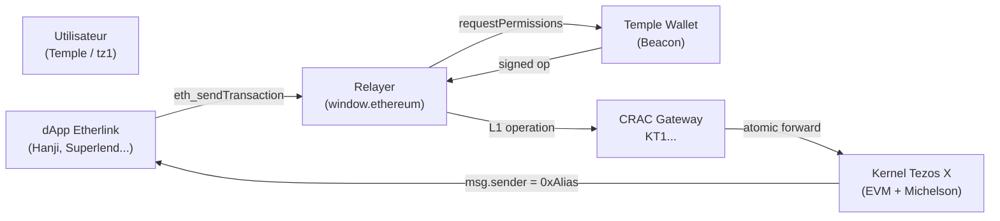

# Architecture Overview

The relayer sits between Etherlink dApps and the Tezos L1, acting as a translation layer that maps EVM calls to Tezos operations.

## Flow diagram



## Components

| Component | Role |
|---|---|
| **RelayerProvider** | Implements `EIP1193Provider`, handles all `window.ethereum` calls |
| **BeaconClient** | Connects to Temple wallet via Beacon SDK |
| **TezlinkClient** | Sends operations to Tezos L1 via Tezlink RPC |
| **GatewayBuilder** | Builds Micheline calldata for the CRAC gateway |
| **EIP-6963 announcer** | Broadcasts provider info for modern dApp wallet pickers |

## Address derivation

Every tz1 address has a deterministic EVM alias:

```
tz1 → SHA3(prefix + tz1_bytes) → 0xAlias
```

This alias is computed by the Tezlink RPC via `tez_getEthereumTezosAddress` and used as the account returned by `eth_requestAccounts`.
