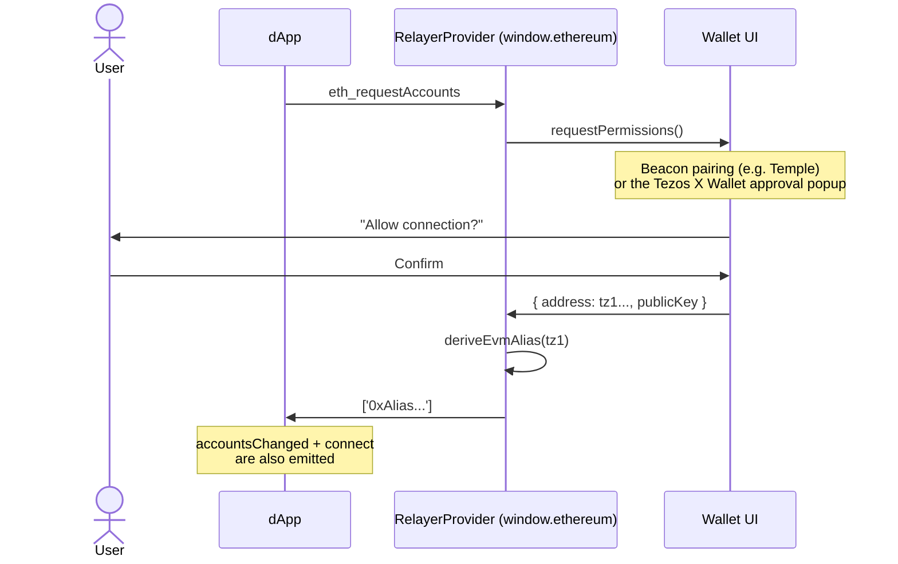

# Connect Wallet Flow

Connecting means the dApp calls `eth_requestAccounts` on the injected EIP-1193
provider and receives the **EVM alias** — a `0x` address deterministically
derived from the user's tz1 account. From that point the dApp treats the user
like any other EVM account.

:::note Which wallet UI opens?
The `RelayerProvider` is constructed with a wallet backend (the
`ITezosWalletClient` port), and the UI the user sees depends on that backing
client:

- **`BeaconClient`** — the Beacon pairing flow opens a wallet picker, and the
  chosen Tezos wallet (for example Temple) shows the permission prompt.
- **Tezos X Wallet extension** — the wallet embeds the same provider around its
  own signer, so its own approval popup opens and no third-party wallet is
  involved. See [dApp Approval](/wallet/user-flows/dapp-approval).

The dApp-side code is identical in both cases.
:::

## Sequence



## Discovering the provider (EIP-6963)

Prefer [EIP-6963 discovery](../architecture/eip6963) over reading
`window.ethereum` directly — several wallets may be installed, and discovery
lets the user pick:

```ts
interface Provider {
  request(args: { method: string; params?: unknown[] }): Promise<unknown>;
  on(event: string, handler: (...args: never[]) => void): void;
}
interface Eip6963ProviderDetail {
  info: { uuid: string; name: string; rdns: string; icon: string };
  provider: Provider;
}

const providers: Eip6963ProviderDetail[] = [];

window.addEventListener('eip6963:announceProvider', (e) => {
  const detail = (e as CustomEvent<Eip6963ProviderDetail>).detail;
  if (!providers.some((p) => p.info.uuid === detail.info.uuid)) {
    providers.push(detail);
  }
});
window.dispatchEvent(new Event('eip6963:requestProvider'));
```

## Connecting

The connect sequence is: `eth_requestAccounts`, an optional `tez_getAccounts`
to read the underlying tz1, then `eth_chainId`. Two points deserve care:

- `tez_getAccounts` is specific to the `RelayerProvider`. Other EIP-1193
  backends (including a WalletConnect provider) do not implement it — tolerate
  a "method not found" rejection instead of treating it as a failure.
- A user closing or rejecting the wallet prompt surfaces as an EIP-1193 error
  with numeric `code` `4001` — match on the code, not on the message text.

```ts
async function connect(provider: Provider) {
  try {
    const accounts = await provider.request({ method: 'eth_requestAccounts' }) as string[];
    const evmAlias = accounts[0] ?? null;

    // Optional: the RelayerProvider also exposes the underlying tz1 address.
    let tz1Address: string | null = null;
    try {
      const tezAccounts = await provider.request({ method: 'tez_getAccounts' }) as string[];
      tz1Address = tezAccounts?.[0] ?? null;
    } catch (e) {
      const err = e as { code?: number; message?: string };
      const methodNotFound = err.code === -32601
        || (typeof err.message === 'string' && /method not found|unsupported/i.test(err.message));
      if (!methodNotFound) throw e;
    }

    const chainId = await provider.request({ method: 'eth_chainId' }) as string;
    return { evmAlias, tz1Address, chainId };
  } catch (e) {
    if ((e as { code?: number }).code === 4001) {
      // User rejected the permission request — reset the connect UI, don't
      // render this as an application error.
      return null;
    }
    throw e;
  }
}
```

## Silent session restore on page load

If the backing client already has an active account (typically after a page
reload), the provider constructor re-establishes the session **without any
user interaction**: it reads the active account, derives the EVM alias,
fetches the chain id, then emits `accountsChanged` with the alias followed by
`connect` with `{ chainId }`.

Practical consequence: a dApp that only updates its state inside a
button-triggered `eth_requestAccounts` flow will miss the restore. Subscribe
to `accountsChanged` at startup and treat a non-empty payload as "connected".

The restore is best-effort: if the network is unreachable when the page loads
(the alias derivation and chain-id reads are RPCs), the session simply stays
`null` and is re-established lazily by the next request — no event fires and
no error is thrown.

## `eth_requestAccounts` does not re-prompt

When a session already exists, `eth_requestAccounts` returns it immediately —
no pairing flow, no popup. This is why the wallet UI "doesn't open" on a
second connect click, and combined with the silent restore above it means a
returning user is typically connected without ever seeing a prompt. To force
a fresh pairing, disconnect first (`wallet_revokePermissions`).

## Account switching

When the user switches accounts in the backing wallet, the provider re-derives
the alias and re-emits `accountsChanged` with the new alias as its single
entry (nothing is emitted if the alias is unchanged, and a transient network
failure keeps the previous account). When the wallet reports **no** active
account, the provider clears the session, emits `accountsChanged` with an
empty array, then emits `disconnect` whose payload is an error with code
`4100`.

## Events to subscribe

Subscribe to `accountsChanged` and `disconnect`; `connect` is also emitted
(on session establishment and restore) if you want a positive signal:

```ts
provider.on('accountsChanged', (accounts: string[]) => {
  if (accounts.length === 0) {
    // Disconnected or account removed — reset state.
  } else {
    // accounts[0] is the (possibly new) EVM alias.
  }
});

provider.on('disconnect', (error: { code: number }) => {
  // error.code is 4100; reset state.
});
```

Do **not** gate anything on `chainChanged`: the provider serves a single chain
and never emits it.

## Console commands

```js
// Connect
const accounts = await window.ethereum.request({ method: 'eth_requestAccounts' });
console.log(accounts); // ['0x341af4de...']

// Disconnect (clears the session; next connect re-prompts)
await window.ethereum.request({ method: 'wallet_revokePermissions' });
```

## Troubleshooting (Beacon-backed setups)

If the Beacon pairing modal doesn't open, a stale Beacon session is usually
the cause. Clear it and reload:

```js
Object.keys(localStorage)
  .filter(k => k.startsWith('beacon'))
  .forEach(k => localStorage.removeItem(k));
location.reload();
```

Pairing behaviour (QR scan vs. direct extension pairing) depends on the Beacon
SDK and the wallet version installed — it is not fixed by the relayer.

## See also

- [dApp Approval (Tezos X Wallet)](/wallet/user-flows/dapp-approval) — the connection flow when the standalone wallet backs the provider
- [Transfer flow](./transfer) — what happens after connecting
- [dApp Compatibility](./dapp-compatibility) — which dApp stacks detect the relayer
- [Quickstart](/docs/quickstart) — end-to-end setup
