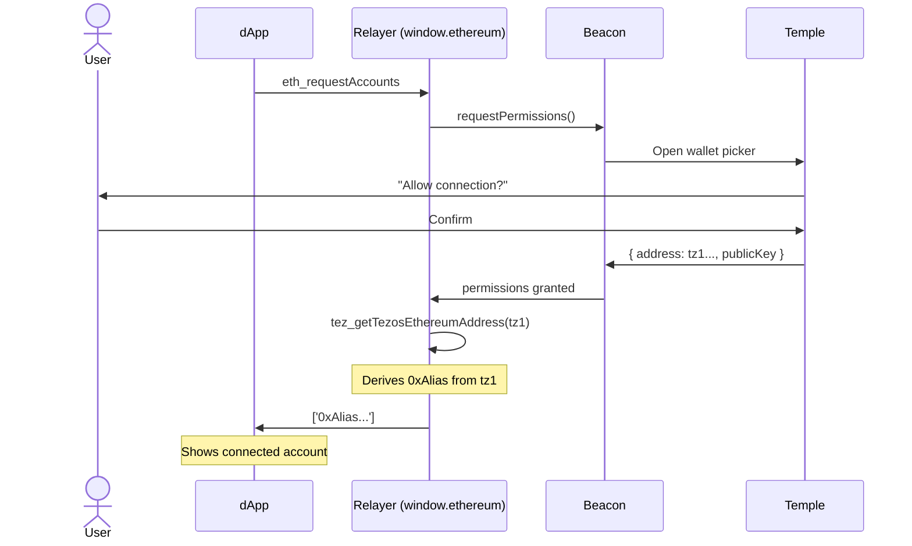

# Connect Wallet Flow

:::note Two ways to connect
This page describes connecting via the **TezosX Relayer** extension (requires Temple Wallet). If you are using the **TezosX Wallet** extension instead, see [dApp Approval](/wallet/user-flows/dapp-approval) — the wallet handles connections without Temple.
:::

:::warning Temple mobile only
The Beacon pairing currently works with **Temple mobile** (QR-code scan) only. Pairing with the Temple browser extension did not complete when last verified against Temple (at the time of writing). If the extension pairing starts working with a newer Temple release, this constraint no longer applies.
:::

## Sequence



## Console commands

```js
// Connect
const accounts = await window.ethereum.request({ method: 'eth_requestAccounts' });
console.log(accounts); // ['0x341af4de...']

// Disconnect
await window.ethereum.request({ method: 'wallet_revokePermissions' });

// Clear Beacon session (if modal doesn't open)
Object.keys(localStorage)
  .filter(k => k.startsWith('beacon'))
  .forEach(k => localStorage.removeItem(k));
location.reload();
```

## Notes

- If the Beacon modal doesn't open, clear the Beacon localStorage session using the console command above and reload the page

## See also

- [dApp Approval (TezosX Wallet)](/wallet/user-flows/dapp-approval) — the connection flow when using the standalone wallet instead of Temple
- [Transfer flow](./transfer) — what happens after connecting
- [dApp Compatibility](./dapp-compatibility) — which dApp stacks detect the relayer
