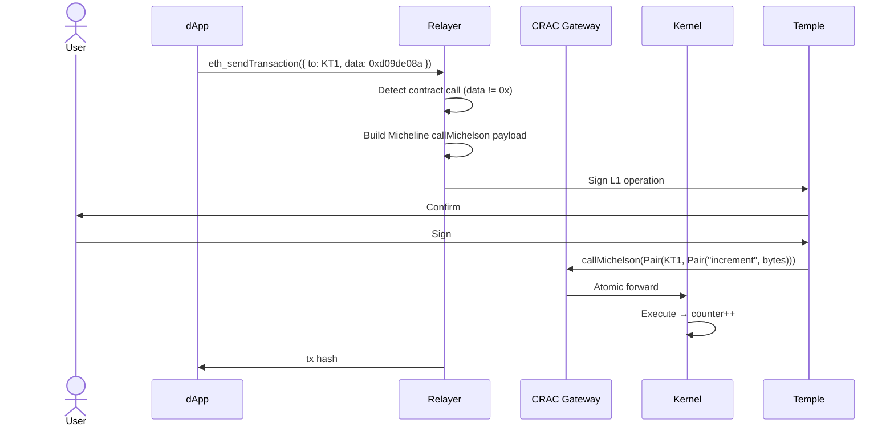

# Smart Contract Call Flow

Call a Michelson smart contract from an Etherlink dApp via the CRAC gateway.

## Example: Counter contract

```js
// increment()
await window.ethereum.request({
  method: 'eth_sendTransaction',
  params: [{
    to: '0x7b0e325FF8F70d21891A7494B5715C6dC3d08D7b',
    data: '0xd09de08a', // increment() selector
    gas: '0x186a0',
  }]
});
```

## Function selectors (Counter)

| Function | Selector |
|---|---|
| `increment()` | `0xd09de08a` |
| `decrement()` | `0x2baeceb7` |
| `setNumber(uint256)` | `0x3fb5c1cb` |
| `retrieve()` | `0x2e64cec1` |

## Sequence



## ABI encoding

```js
// setNumber(42)
function encodeSetNumber(value) {
  const hex = value.toString(16).padStart(64, '0');
  return '0x3fb5c1cb' + hex;
}

await window.ethereum.request({
  method: 'eth_sendTransaction',
  params: [{
    to: '0x7b0e325FF8F70d21891A7494B5715C6dC3d08D7b',
    data: encodeSetNumber(42),
  }]
});
```
