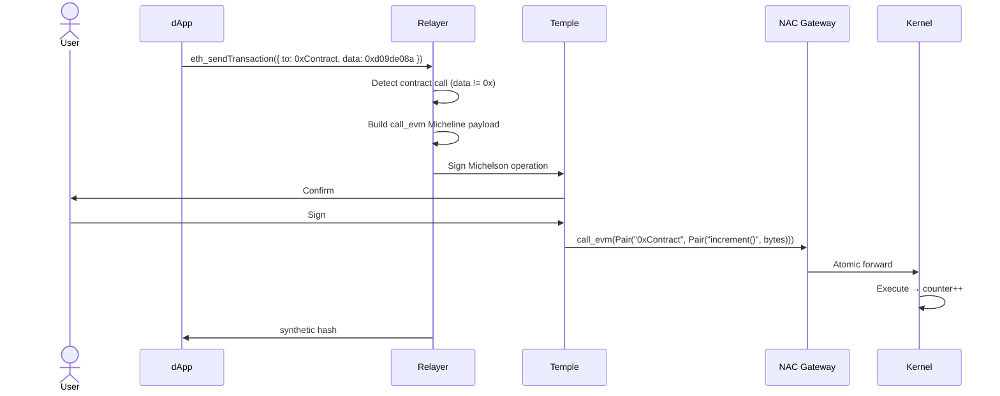

# Smart Contract Call Flow

Call an EVM smart contract from a Tezos X EVM dApp via the NAC gateway.

## Example: Counter contract

```js
// increment()
await window.ethereum.request({
  method: 'eth_sendTransaction',
  params: [{
    to: '0x7b0e325FF8F70d21891A7494B5715C6dC3d08D7b',
    data: '0xd09de08a', // increment() selector
    gas: '0x186a0',
  }]
});
```

## Function selectors (Counter)

| Function | Selector | Notes |
|---|---|---|
| `increment()` | `0xd09de08a` | |
| `decrement()` | `0x2baeceb7` | |
| `setNumber(uint256)` | `0x3fb5c1cb` | |
| `retrieve()` | `0x2e64cec1` | Read — goes through `eth_call`, not the gateway |

Only selectors on the relayer's curated allow-list can be sent via
`eth_sendTransaction`; unknown selectors are rejected with
`UnknownSelectorError` before any signing popup opens. See
[Selector resolution](../architecture/nac-gateway#selector-resolution).

## Sequence



The hash returned to the dApp is a **synthetic hash** — the real
kernel-synthesized EVM hash is resolved lazily. See
[EIP-1193 → synthetic hash](../architecture/eip1193#transaction-receipts--the-synthetic-hash).

## ABI encoding

```js
// setNumber(42)
function encodeSetNumber(value) {
  const hex = value.toString(16).padStart(64, '0');
  return '0x3fb5c1cb' + hex;
}

await window.ethereum.request({
  method: 'eth_sendTransaction',
  params: [{
    to: '0x7b0e325FF8F70d21891A7494B5715C6dC3d08D7b',
    data: encodeSetNumber(42),
  }]
});
```

## See also

- [Transfer flow](./transfer) — the empty-calldata path
- [API Reference](../technical/api-reference) — `eth_sendTransaction` and the typed errors
- [NAC Gateway](../architecture/nac-gateway) — `call_evm` signature and selector resolution
