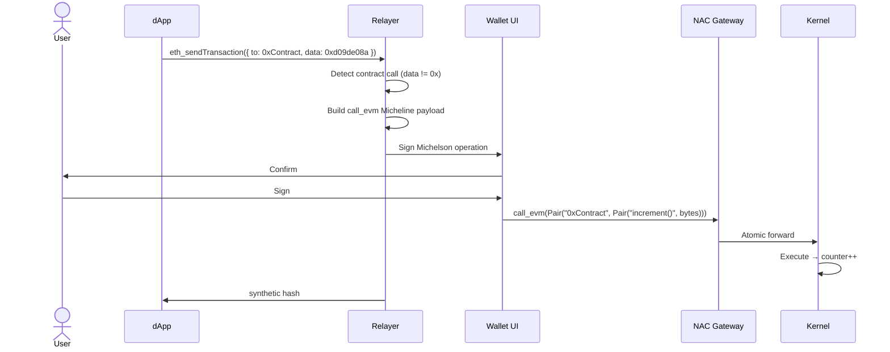

# Smart Contract Call Flow

Call an EVM smart contract from a Tezos X EVM dApp via the NAC gateway. A
transaction with non-empty calldata is routed through the gateway's
`call_evm` entrypoint.

## Example: Counter contract

```js
// increment()
await window.ethereum.request({
  method: 'eth_sendTransaction',
  params: [{
    to: '0x525982C267F4B93cCB075B9323B069A993a9DEd7',
    data: '0xd09de08a', // increment() selector
  }]
});
```

:::info Gas fields are ignored
`gas`, `gasPrice`, `maxFeePerGas` and `maxPriorityFeePerGas` are silently
ignored on this path — the relayer reads only `to`, `value` and `data`. The
transaction executes as a Michelson operation whose fee is denominated in
mutez and computed when the wallet signs; there is no EVM gas market to bid
into. Correspondingly, `eth_estimateGas` answers a constant headroom figure
and `eth_gasPrice` answers `0x0`. See [Gotchas](/docs/gotchas).
:::

## Function selectors (Counter)

| Function | Selector | Notes |
|---|---|---|
| `increment()` | `0xd09de08a` | |
| `decrement()` | `0x2baeceb7` | |
| `setNumber(uint256)` | `0x3fb5c1cb` | |
| `retrieve()` | `0x2e64cec1` | Read — goes through `eth_call`, not the gateway |

Only selectors on the relayer's curated allow-list can be sent via
`eth_sendTransaction`; an unknown selector is rejected with
`UnknownSelectorError` (JSON-RPC `-32602`) before any signing popup opens.
Extending the list is a **code change in the relayer, not configuration** —
each entry's text signature is embedded verbatim in the signed Micheline
payload and is reviewed before being added. See
[Selector resolution](../architecture/nac-gateway#selector-resolution).

## Sequence



The hash returned to the dApp is a **synthetic hash** — the real
kernel-synthesized EVM hash is resolved lazily. See
[EIP-1193 → synthetic hash](../architecture/eip1193#transaction-receipts--the-synthetic-hash).

## ABI encoding

```ts
// setNumber(42)
function encodeSetNumber(num: bigint): string {
  return '0x3fb5c1cb' + num.toString(16).padStart(64, '0');
}

await window.ethereum.request({
  method: 'eth_sendTransaction',
  params: [{
    to: '0x525982C267F4B93cCB075B9323B069A993a9DEd7',
    data: encodeSetNumber(42n),
  }]
});
```

## Attaching value

A payable contract call may carry a `value`, and the same mutez-alignment
rule as [transfers](./transfer#value-encoding) applies: the wei → mutez
conversion runs on the `call_evm` path too, and a value not divisible by
10¹² wei is rejected with `SubMutezPrecisionError` (`-32602`) before signing.
Compute values as mutez × 10¹² with `BigInt`. The destination check also runs
first on this path: a non-canonical `to` is rejected with
`InvalidDestinationError` (`-32602`).

## See also

- [Transfer flow](./transfer) — the empty-calldata path
- [RelayerProvider](../sdk/provider) — the full `request()` surface · [typed errors](../sdk/cross-runtime#typed-errors)
- [NAC Gateway](../architecture/nac-gateway) — `call_evm` signature and selector resolution
- [Gotchas](/docs/gotchas) — fee model and value alignment
