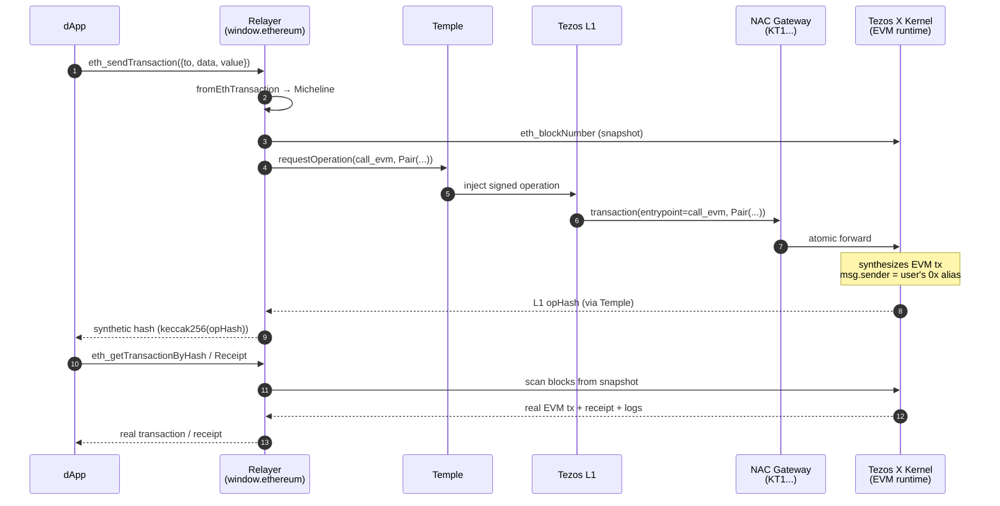

# NAC Gateway

**NAC** (Cross-Runtime Atomic Calls) is the Tezos X mechanism for routing
execution between the Tezos L1 Michelson runtime and the Tezlink EVM runtime
within a single atomic operation.

## The two directions

NAC is bidirectional. Each direction uses a different surface:

| Direction | Surface | Used by |
|---|---|---|
| **EVM → Michelson** | NAC precompile at `0xff00...0007`, called via the EVM selector `callMichelson(string,string,bytes)` | dApps running on Tezlink that want to invoke a Michelson contract |
| **Michelson → EVM** | NAC gateway contract (KT1...) on Tezos L1, entrypoint `call_evm` | **The relayer** — wraps every user EVM transaction as a Tezos L1 op |

## What the relayer does

The relayer uses the **Michelson → EVM** direction. Temple can only sign Tezos L1
operations, so instead of submitting an EVM transaction directly, the relayer
wraps the user's intent into a Tezos L1 op targeting the NAC gateway's
`call_evm` entrypoint. The Tezos X kernel receives the op, synthesizes the
corresponding EVM transaction, and executes it with `msg.sender` set to the
user's EVM alias.

## `call_evm` entrypoint signature

```
pair string (pair string (pair bytes (option (contract bytes))))
```

| Field | Type | Content |
|---|---|---|
| `destination` | `string` | The target EVM contract address (`0x...`) |
| `method_sig`  | `string` | The full text signature of the EVM function, e.g. `"transfer(address,uint256)"`. The kernel recomputes the 4-byte selector from this string. |
| `calldata`    | `bytes`  | ABI-encoded parameters (no selector prefix — the kernel prepends it) |
| `callback`    | `option (contract bytes)` | Optional Michelson callback invoked by the kernel after the EVM call finishes. The relayer always passes `None` (the second argument of `GatewayBuilder.fromEthTransaction` is defaulted to `{ prim: 'None' }` and exposed for future use cases). |

## Micheline built by the relayer

For a non-empty calldata EVM transaction, `GatewayBuilder.fromEthTransaction`
produces:

```json
{
  "prim": "Pair",
  "args": [
    { "string": "0xTargetEvmAddress" },
    { "prim": "Pair", "args": [
        { "string": "transfer(address,uint256)" },
        { "prim": "Pair", "args": [
            { "bytes": "abi-encoded-params-hex" },
            { "prim": "None" }
          ]
        }
      ]
    }
  ]
}
```

For a bare XTZ transfer (no calldata), the relayer uses the `default`
entrypoint instead:

```json
{ "string": "0xRecipient" }
```

## Flow



## Sender identity

When the kernel executes the synthesized EVM transaction:

- On the **EVM side**: `msg.sender` is the user's EVM alias (`0x...`), derived
  deterministically from their tz1 address via `tez_getTezosEthereumAddress`.
- On the **Michelson side** (if the EVM call then invokes `callMichelson`):
  `Tezos.get_sender` returns the user's tz1 address, not the NAC gateway's
  address.

:::info
The NAC gateway is a pass-through for identity. Both the EVM alias and the
tz1 address refer to the same user, and the kernel preserves this mapping
across the runtime boundary.
:::
