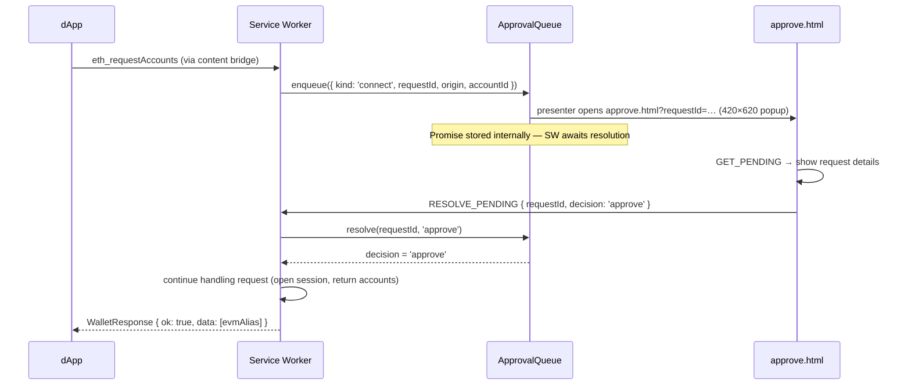
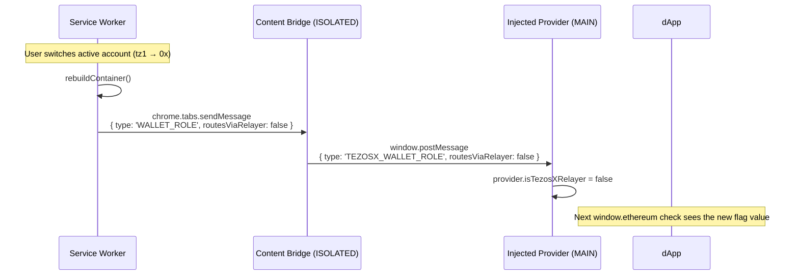

# dApp Bridge & Approval Queue

When a dApp calls `eth_requestAccounts`, `eth_sendTransaction`, or `personal_sign`, the wallet cannot proceed silently — it must show the user a consent screen. The `ApprovalQueue` ([`packages/core/src/background/approval-queue.ts`](https://github.com/trilitech/tezos-x-wallet/blob/main/packages/core/src/background/approval-queue.ts)) manages this flow. The queue itself is platform-neutral; the extension presents each request as a `chrome.windows` popup via [`ChromeApprovalPresenter`](https://github.com/trilitech/tezos-x-wallet/blob/main/packages/wallet/src/adapters/chrome/chrome-approval-presenter.ts).

## Three request types

| Kind | Triggered by | Shown in approve window |
|---|---|---|
| `connect` | `eth_requestAccounts` | Site origin + permission summary |
| `transaction` | `eth_sendTransaction` | Destination, value, calldata, method signature (when the selector is in the relayer's known-signature allow-list). For a Tezos-source account, also the actual Michelson call that will be signed: NAC gateway target, entrypoint (`call` / `call_evm`), and the exact mutez value debited. |
| `signature` | `personal_sign` | Raw hex payload plus a best-effort UTF-8 decode (withheld when the bytes contain bidirectional or zero-width characters that could disguise what is signed) |

`eth_signTypedData*` never reaches the queue — it is refused before prompting, because neither signer implements it.

## Approval flow



Each pending request is **pinned to the account that was active when it was enqueued** (`accountId`), so switching accounts mid-approval cannot re-target it. On an approved `connect`, the service worker writes a per-origin `StoredSession`:

```ts
interface StoredSession {
  origin:      string;
  accountId?:  string;   // the account this origin is bound to
  tz1Address:  string;   // empty for EVM-native accounts
  evmAlias:    string;   // the address the dApp sees
  chainId:     string;
  connectedAt: number;
}
```

The presenter picks the surface: when a wallet view (side panel or popup) is open — it holds a long-lived UI port with the service worker — the approval renders inside that view instead, and the sequence above is otherwise identical. The approve.html window is the fallback when no view is open.

Closing the approval window with the X counts as a rejection: the presenter maps the window's `onRemoved` event back to the queue's dismiss callback. Closing the last open wallet view while an in-view approval is showing rejects the same way.

## `enqueue()` internals

Simplified from the real implementation:

```ts
async enqueue(request: PendingRequest): Promise<'approve' | 'reject'> {
  if (this.queue.has(request.requestId)) {
    throw new DuplicateRequestIdError(request.requestId);
  }
  if (pendingCountFor(request.origin) >= MAX_PENDING_PER_ORIGIN) {  // 3
    throw new TooManyPendingRequestsError(request.origin);          // dApp receives -32005
  }

  const decision = new Promise<Decision>((resolve) => { resolveDecision = resolve; });
  this.queue.set(request.requestId, { request, resolve: resolveDecision });
  this.syncBadge();

  // The platform presenter shows the approval UI — in the extension, a
  // chrome.windows.create popup. Dismissing it rejects the request.
  await this.presenter.open(request.requestId, () =>
    this.resolve(request.requestId, 'reject'),
  );
  return decision;
}
```

The `resolve` function is stored alongside the request. When `approve.html` sends `RESOLVE_PENDING`, the service worker calls `queue.resolve(requestId, decision)`, which fires the stored resolve and unblocks the awaiting handler. Entries are immutable once enqueued — a colliding request id can never replace what the approval UI is showing — and one origin may hold at most **3** requests in flight, so a page looping requests cannot flood the desktop with popups.

## `rejectAll()` on lock

When the wallet locks (manually, by auto-lock, or on service-worker suspend), all pending approvals are immediately rejected:

```ts
// packages/core/src/use-cases/lock-vault.ts — run by the LOCK handler
keyring.lock();                          // zeroizes the vault key
approvalQueue.rejectAll('wallet locked');
// the SW then drops the active container and clears the container cache
```

Any dApp awaiting a response receives an EIP-1193 error `4001 — User rejected the request`.

## `approve.html` — the consent window

`approve.html` is **not** web-accessible: the manifest's `web_accessible_resources` is empty by design, and the build pipeline verifies it stays that way. The service worker opens the window itself via `chrome.windows.create`, which needs no web-accessible entry — no web page can load or frame the consent window, which is the wallet's first line of defense against clickjacking (backed by `frame-ancestors 'none'` in the extension-pages CSP and a runtime iframe guard in the page itself).

It reads the `requestId` query parameter, calls `GET_PENDING` to fetch the request details from the service worker, and renders either:

- **Connection request**: origin hostname, permission description, Approve / Reject buttons
- **Transaction request**: destination address, value in XTZ, calldata hex, method signature (when resolved from the relayer's known-selector allow-list), Approve / Reject buttons
- **Signature request**: the raw hex payload and, when it decodes to clean text, its UTF-8 form

The window is automatically closed by the service worker after `RESOLVE_PENDING` is handled.

## Provider identity & dApp detection

The injected provider exposes three identity flags on `window.ethereum` plus an EIP-6963 announcement:

| Flag / field | Value | Purpose |
|---|---|---|
| `isMetaMask` | `false` | Standard "I am not MetaMask" signal. dApps that hard-require MetaMask will see this and either reject or fall back to a generic EVM flow. |
| `isTezosXWallet` | `true` (constant) | Stable identity flag for our wallet. **dApps that want to detect us specifically should branch on this.** |
| `isTezosXRelayer` | `true` if the active account is Tezos-source, `false` if EVM-source | **Dynamic.** Signals whether outgoing EVM calls currently route through the NAC gateway. Used to be a static `true` until 0.11.1, which broke dApps that branch on it because EVM-source 0x accounts don't route through the gateway. |
| EIP-6963 RDNS | `com.tezosx.wallet` | Discovery identifier for EIP-6963-aware dApps. |

The `isTezosXRelayer` flag is kept accurate via a `WALLET_ROLE` `ContentPush` event the SW broadcasts on every container rebuild (unlock, account switch, lock):



### Why this matters

dApps that have TezosX-aware branching often gate on `isTezosXRelayer`. The original relayer extension (legacy, Temple-backed) exposed the flag as a way to say "this provider routes via NAC; skip the EVM-runtime XTZ gas check, the user pays fees in mutez on the Michelson runtime". A dApp that reads the flag and assumes "the wallet handles the cross-runtime nuance internally" might skip steps that are standard for native EVM (e.g. an explicit ERC-20 `approve` before `deposit`).

For an EVM-source 0x account in our wallet, no NAC routing happens — calls go directly to the Tezlink EVM RPC, indistinguishable from MetaMask's behaviour. The flag must reflect that, otherwise dApps treat the wallet as a Tezos-source relayer and break standard EVM flows. Hence the dynamic mutation since 0.11.1.

### dApp integration guidance

For dApps targeting Tezos X across both account kinds:

- **Use `isTezosXWallet` to detect our wallet.** That flag is stable and unambiguous.
- **Read `isTezosXRelayer` to know if a TezosX-specific path applies right now.** If `true`, the user is on a tz1 account and your call will be wrapped in a NAC Michelson op; consider skipping EVM-runtime XTZ balance checks and surfacing a "cross-runtime" notice. If `false`, treat the call as standard EVM.
- **Connections are pinned, the flag is not.** Switching the active account in the wallet does not re-point existing connections — each origin stays bound to the account it connected with, and no `accountsChanged` fires for a mere switch (it fires with an empty list only if the bound account is removed). The `isTezosXRelayer` flag, however, tracks the wallet's *active* account, so treat it as a routing hint at connect / transaction time rather than a per-session constant.
