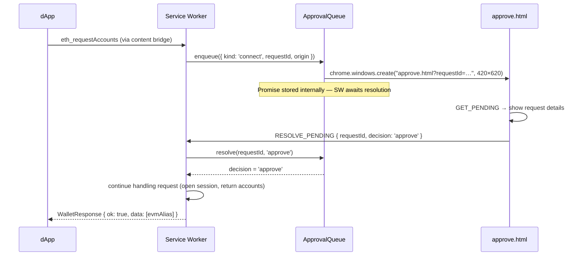
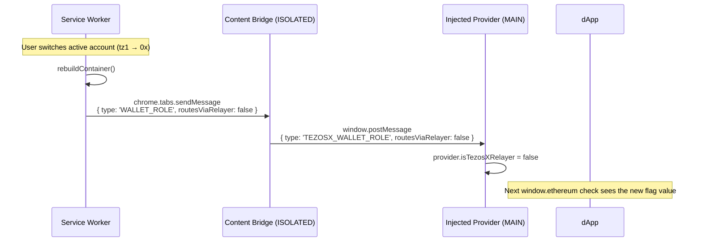

# dApp Bridge & Approval Queue

When a dApp calls `eth_requestAccounts` or `eth_sendTransaction`, the wallet cannot proceed silently — it must show the user a consent screen. The `ApprovalQueue` ([`packages/wallet/src/background/approval-queue.ts`](https://github.com/trilitech/tezos-x-wallet/blob/main/packages/wallet/src/background/approval-queue.ts)) manages this flow.

## Two request types

| Kind | Triggered by | Shown in approve window |
|---|---|---|
| `connect` | `eth_requestAccounts` | Site origin + permission summary |
| `transaction` | `eth_sendTransaction` | Destination, value, calldata, method signature |

## Approval flow



If the user closes the window without deciding, the promise is rejected when `rejectAll()` is called (e.g. on lock).

## `enqueue()` internals

```ts
async enqueue(request: PendingRequest): Promise<'approve' | 'reject'> {
  return new Promise((resolve) => {
    const win = chrome.windows.create({
      url: `approve.html?requestId=${request.requestId}`,
      type: 'popup', width: 420, height: 620,
    });
    this.pending.set(request.requestId, { request, resolve, windowId: win.id });
  });
}
```

The `resolve` function is stored alongside the request. When `approve.html` calls `RESOLVE_PENDING`, the service worker calls `queue.resolve(requestId, decision)`, which fires the stored resolve and unblocks the awaiting handler.

## `rejectAll()` on lock

When the wallet locks, all pending approvals are immediately rejected:

```ts
// service-worker.ts — LOCK handler
keyring.lock();
provider = null;
queue.rejectAll('wallet locked');
```

Any dApp awaiting a response receives an EIP-1193 error `4001 — User rejected the request`.

## `approve.html` — the consent window

`approve.html` is listed under `web_accessible_resources` in the manifest so Chrome can load it as a standalone popup window (not inside the extension popup frame).

It reads the `requestId` query parameter, calls `GET_PENDING` to fetch the request details from the service worker, and renders either:

- **Connection request**: origin hostname, permission description, Approve / Reject buttons
- **Transaction request**: destination address, value in XTZ, calldata hex, method signature (if resolved from the 4byte registry), Approve / Reject buttons

The window is automatically closed by the service worker after `RESOLVE_PENDING` is handled.

## Provider identity & dApp detection

The injected provider exposes three identity flags on `window.ethereum` plus an EIP-6963 announcement:

| Flag / field | Value | Purpose |
|---|---|---|
| `isMetaMask` | `false` | Standard "I am not MetaMask" signal. dApps that hard-require MetaMask will see this and either reject or fall back to a generic EVM flow. |
| `isTezosXWallet` | `true` (constant) | Stable identity flag for our wallet. **dApps that want to detect us specifically should branch on this.** |
| `isTezosXRelayer` | `true` if the active account is Tezos-source, `false` if EVM-source | **Dynamic.** Signals whether outgoing EVM calls currently route through the NAC gateway. Used to be a static `true` until 0.11.1, which broke dApps that branch on it because EVM-source 0x accounts don't route through the gateway. |
| EIP-6963 RDNS | `com.tezosx.wallet` | Discovery identifier for EIP-6963-aware dApps. |

The `isTezosXRelayer` flag is kept accurate via a `WALLET_ROLE` `ContentPush` event the SW broadcasts on every container rebuild (unlock, account switch, lock):



### Why this matters

dApps that have TezosX-aware branching often gate on `isTezosXRelayer`. The original relayer extension (legacy, Temple-backed) exposed the flag as a way to say "this provider routes via NAC; skip the L2 XTZ gas check, the user pays fees in mutez on L1". A dApp that reads the flag and assumes "the wallet handles the cross-runtime nuance internally" might skip steps that are standard for native EVM (e.g. an explicit ERC-20 `approve` before `deposit`).

For an EVM-source 0x account in our wallet, no NAC routing happens — calls go directly to the Tezlink EVM RPC, indistinguishable from MetaMask's behaviour. The flag must reflect that, otherwise dApps treat the wallet as a Tezos-source relayer and break standard EVM flows. Hence the dynamic mutation since 0.11.1.

### dApp integration guidance

For dApps targeting Tezos X across both account kinds:

- **Use `isTezosXWallet` to detect our wallet.** That flag is stable and unambiguous.
- **Read `isTezosXRelayer` to know if a TezosX-specific path applies right now.** If `true`, the user is on a tz1 account and your call will be wrapped in a NAC Michelson op; consider skipping L2 XTZ balance checks and surfacing a "cross-runtime" notice. If `false`, treat the call as standard EVM.
- **Re-read on `accountsChanged`.** The flag can change between two reads if the user switches account kind in the wallet. The change is pushed as a `WALLET_ROLE` event but only the injected provider sees it; the dApp learns indirectly via the next `accountsChanged` (the SW also broadcasts that on account switch).
