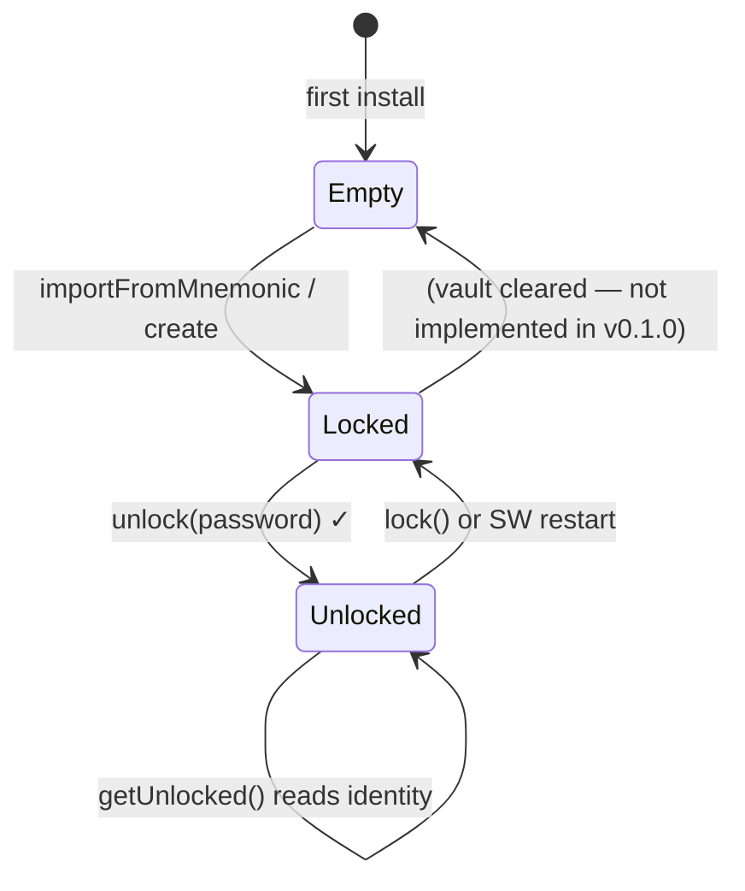

# Keyring & Vault

The `Keyring` class ([`packages/wallet/src/background/keyring.ts`](https://gitlab.com/tezos-infra/techrel/support-xdev-qa/tezosx-relayer/-/blob/main/packages/wallet/src/background/keyring.ts)) manages the full lifecycle of a Tezos identity: creation, encrypted persistence, unlocking, and export.

## Storage model

The encrypted vault is stored in `chrome.storage.local` under the key `tezosx_vault`. It is a JSON object with four fields:

```ts
interface EncryptedVault {
  salt:       string;   // 32 random bytes, hex-encoded
  iv:         string;   // 12 random bytes, hex-encoded
  ciphertext: string;   // AES-256-GCM encrypted mnemonic, hex-encoded
  iterations: number;   // PBKDF2 iteration count (200 000)
}
```

Nothing else is persisted. The derived keys (tz1 address, public key, secret key) are never written to disk.

## Encryption

```
password  ──PBKDF2-SHA256──►  derivedKey (256-bit)
                  │
                 salt (256-bit random)
                 iterations = 200 000

mnemonic  ──AES-256-GCM──►  ciphertext
                  │
                 derivedKey
                 iv (96-bit random)
```

PBKDF2 with 200 000 iterations makes brute-force attacks on the password significantly expensive. A fresh salt and IV are generated for every `create` / `importFromMnemonic` call.

## Key derivation

After decrypting the mnemonic, the keyring derives the Tezos identity via BIP-39 → BIP-32 → SLIP-10:

```
mnemonic  ──BIP-39──►  seed (512-bit)
seed  ──SLIP-10 (ed25519)──►  private key at m/44'/1729'/0'/0'
private key  ──►  tz1 address  (ed25519 public key hash, Base58Check)
              ──►  publicKey   (edpk…)
              ──►  secretKey   (edsk…)
```

The derivation path `m/44'/1729'/0'/0'` is the standard Tezos account path (BIP-44 coin type 1729).

## In-memory state

When unlocked, the keyring holds an `UnlockedIdentity` in memory:

```ts
interface UnlockedIdentity {
  tz1:       string;   // tz1…
  publicKey: string;   // edpk…
  secretKey: string;   // edsk…
}
```

**This object is never persisted.** Calling `lock()` or restarting the service worker clears it immediately. The user must re-enter their password to unlock again.

## Public API

```ts
class Keyring {
  hasVault(): Promise<boolean>
  isUnlocked(): boolean
  getUnlocked(): UnlockedIdentity | null

  // Create a fresh 24-word wallet and encrypt it
  create(password: string): Promise<string>           // returns mnemonic

  // Import an existing mnemonic and encrypt it
  importFromMnemonic(mnemonic: string, password: string): Promise<void>

  // Decrypt vault with password, load identity into memory
  unlock(password: string): Promise<void>

  // Clear in-memory identity (vault stays on disk)
  lock(): void

  // Re-decrypt vault and return the mnemonic (for user export)
  exportMnemonic(password: string): Promise<string>
}
```

## Lifecycle



:::warning Service worker restarts
Chrome may kill the service worker at any time (typically after 30 seconds of inactivity). When it restarts, `isUnlocked()` returns `false` even if the user was previously unlocked. The popup detects this via `GET_STATE` and shows the Unlock screen.
:::
