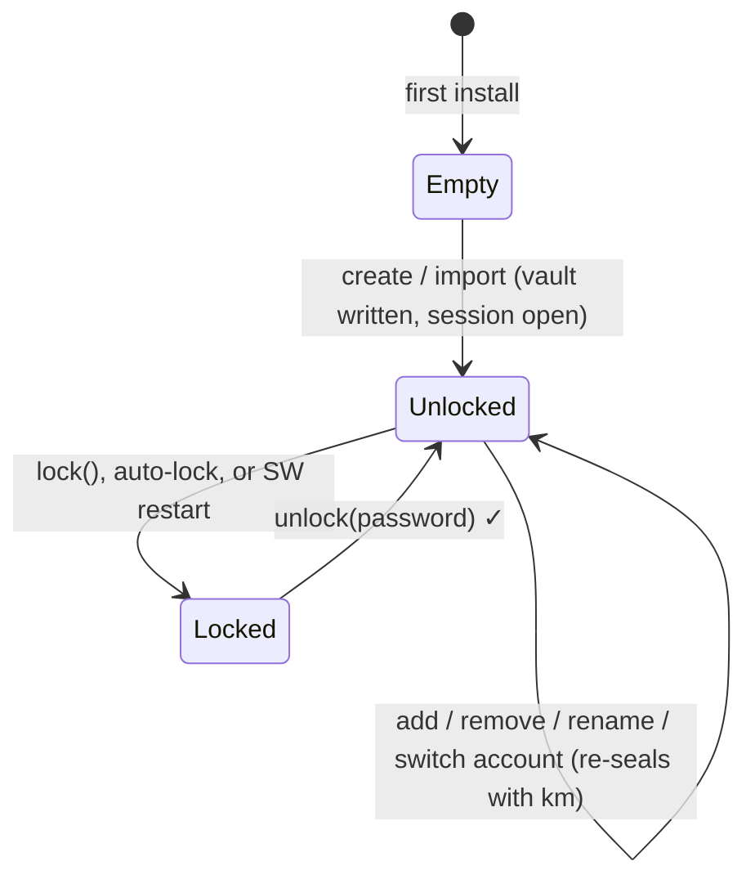

# Keyring & Vault

The `Keyring` class ([`packages/core/src/background/keyring.ts`](https://github.com/trilitech/tezos-x-wallet/blob/main/packages/core/src/background/keyring.ts)) manages the full lifecycle of every account in the vault — Michelson (`tz1…`) or EVM-native (`0x…`) — including creation, import, HD derivation, encrypted persistence, unlocking, in-place format migration, and export. It lives in the shared `@tezosx/wallet-core` package, so the exact same code runs in the Chrome extension and in the mobile app; only the crypto and storage adapters differ per platform.

## Storage model

In the extension, the encrypted vault is stored in `chrome.storage.local` under the key `vault` (`ChromeVaultStore`, [`packages/wallet/src/adapters/chrome/chrome-vault-store.ts`](https://github.com/trilitech/tezos-x-wallet/blob/main/packages/wallet/src/adapters/chrome/chrome-vault-store.ts)). The on-disk envelope:

```ts
interface EncryptedVault {
  ciphertext: string;   // AES-256-GCM ciphertext of the JSON payload, base64-encoded
  iv:         string;   // 12 random bytes, base64-encoded — fresh for every encryption
  salt:       string;   // 16 random bytes, base64-encoded
  iterations: number;   // PBKDF2 iteration count the vault was sealed at (600 000 today)
}
```

Decryption reads the vault's own `iterations` field, so a vault sealed at an older, lower work factor keeps unlocking. On its next successful unlock the keyring re-derives the key at the current 600 000-iteration factor (with a fresh salt) and re-encrypts the vault in place — this **work-factor upgrade** happens at unlock time because that is the only moment the password is in scope.

The *decrypted* payload is the multi-account **version 3** shape:

```ts
interface MultiAccountVaultPayload {
  version:  3;
  seed?:    { mnemonic: string };               // wallet-level BIP-39 phrase (optional)
  accounts: Account[];                          // TezosAccount | EvmAccount
  active:   AccountId;                          // currently active account
  secrets:  Record<AccountId, AccountSecret>;   // one secret per account
}

type AccountSecret =
  | { kind: 'mnemonic'; value: string }   // standalone BIP-39 phrase (Michelson)
  | { kind: 'edsk';     value: string }   // Tezos edsk… secret key (Michelson)
  | { kind: 'evm-pk';   value: string }   // 32-byte hex private key (EVM-native)
  | { kind: 'derived';  index: number };  // HD index resolved against the wallet seed
```

The wallet-level `seed` is written **only by mnemonic onboarding** (creating a new wallet or importing a phrase): the phrase becomes the wallet seed, with the first account at HD index 0. Later "Add account" operations can then derive further accounts from it.

### v2 → v3 migration

Vaults written by earlier releases use `version: 2` — the same fields, without `seed`. They are migrated on read: `unlock` bumps the version in memory, and the upgraded payload reaches disk on the next mutation (same policy as the work-factor upgrade). The migration never promotes an existing account's mnemonic to the wallet seed — the provenance of a v2 phrase is unknowable, so a migrated vault has no seed until the user goes through mnemonic onboarding. Everything else — accounts, secrets, dApp sessions — carries forward untouched.

Nothing else is persisted. Derived key material (tz1 addresses, public keys, secret keys, EVM addresses) is never written to disk in plaintext.

## Encryption

```
password  ──PBKDF2-SHA-256──►  vault key (256-bit)
                  │
                 salt (16 random bytes)
                 iterations = 600 000

payload JSON  ──AES-256-GCM──►  ciphertext
                  │
                 vault key
                 iv (12 random bytes, fresh per encryption)
```

600 000 iterations of PBKDF2-HMAC-SHA-256 is the OWASP-recommended floor for this construction, and it is the only cost an offline brute-force has to pay — the envelope sits in plaintext-readable extension storage. A fresh salt is generated per vault, and a fresh IV per encryption, as GCM requires. The envelope framing is pure JS (no `btoa`/`atob`), so the same bytes seal and open under Web Crypto (extension) and the mobile crypto port — a vault sealed on one platform unlocks on the other.

Unlock is additionally throttled: the first 5 wrong passwords carry no penalty, then an exponential lockout window arms (5 s, doubling per further failure, capped at 5 minutes). The lockout state is persisted, so it survives a service-worker restart.

## What stays in memory — the retention contract

While unlocked, the keyring holds an `UnlockedKeyring`:

```ts
interface UnlockedKeyring {
  account: Account;                    // the active account (public data only)
  payload: MultiAccountVaultPayload;   // the decrypted vault payload
  km:      VaultKeyMaterial;           // the derived vault key + the salt / work factor it was derived at
}
```

- **The password is never retained.** Mutations (add / remove / rename / switch account) re-seal the vault with the retained `km`, so they need no re-prompt. Flows that must prove the user knows the password — revealing a secret, removing an account — re-prompt, derive a candidate key, and compare it against `km.key` in constant time.
- **No per-account signing key is retained.** `getSigningKeyFor(accountId)` derives signing material on demand when a container is built for that account; nothing sits in a long-lived field.
- **`km.key` is zeroized on lock.** `lock()` overwrites the raw key bytes before dropping the reference. The payload's secrets are JS strings, which cannot be overwritten in place — on lock their guarantee is unreachability, then garbage collection.

## Key derivation

Accounts derived from the wallet seed use standard BIP-44 paths, one branch per account kind:

```
Tezos (ed25519, SLIP-10):   m/44'/1729'/i'/0'   →  tz1… address, edpk… / edsk… keys
EVM   (secp256k1, BIP-32):  m/44'/60'/0'/0/i    →  EIP-55 checksummed 0x address
```

Each kind tracks its own next unused index. Gaps left by removed accounts are never reused — re-deriving an interior index would resurrect an address the user deliberately removed. Because a derived account is always recoverable from the phrase, adding one creates nothing new to back up.

## Public API

```ts
class Keyring {
  // State
  hasVault(): Promise<boolean>
  isUnlocked(): boolean
  getUnlocked(): UnlockedKeyring | null

  // Onboarding — each seals a fresh vault and leaves it unlocked
  create(password)                        // fresh 24-word phrase → wallet seed; returns the mnemonic
  importFromMnemonic(mnemonic, password)  // phrase → wallet seed, first account at HD index 0
  importFromSecretKey(edsk, password)     // standalone Tezos secret key
  importFromEvmPrivkey(hex, password)     // standalone EVM private key

  // Session
  unlock(password)                        // throttled; runs the work-factor and v2 → v3 upgrades
  lock()                                  // zeroizes the vault key

  // Accounts
  addTezosAccount(src, label?)            // src: derived | fresh | mnemonic | edsk
  addEvmAccount(src, label?)              // src: derived | fresh | privkey
  removeAccount(accountId, password)      // password re-verified in constant time
  setActiveAccount(accountId)             // synchronous persist (extension path)
  activateInMemory(accountId)             // deferred-persist switch (mobile path) …
  flushActive()                           // … flushed to disk off the interaction path
  renameAccount(accountId, label)
  listAccounts() / listAccountSummaries()

  // Signing & export
  getSigningKeyFor(accountId)             // derives signing material on demand
  exportSecret(password)                  // active account's secret; re-decrypts from disk
  exportSecretFor(accountId, password)    // any account's secret; re-decrypts from disk
  hasWalletSeed(): boolean
  exportWalletSeed(password)              // the wallet-level phrase; re-decrypts from disk
}
```

`create()` generates a fresh 24-word phrase and delegates to `importFromMnemonic` — the two onboarding paths converge. A vault holds up to 50 accounts. Export flows always return concrete signing material: a `derived` secret is resolved to its edsk / EVM private key before it leaves the keyring, and the wallet-level phrase has its own dedicated export path (`exportWalletSeed`).

## Lifecycle



:::warning Service worker restarts
Chrome may evict the extension service worker after a short idle period. When it restarts, `isUnlocked()` returns `false` even if the user was previously unlocked — the in-memory vault key does not survive eviction (the unlock throttle's lockout state, being persisted, does). The popup detects this via `GET_STATE` and shows the Unlock screen.
:::
