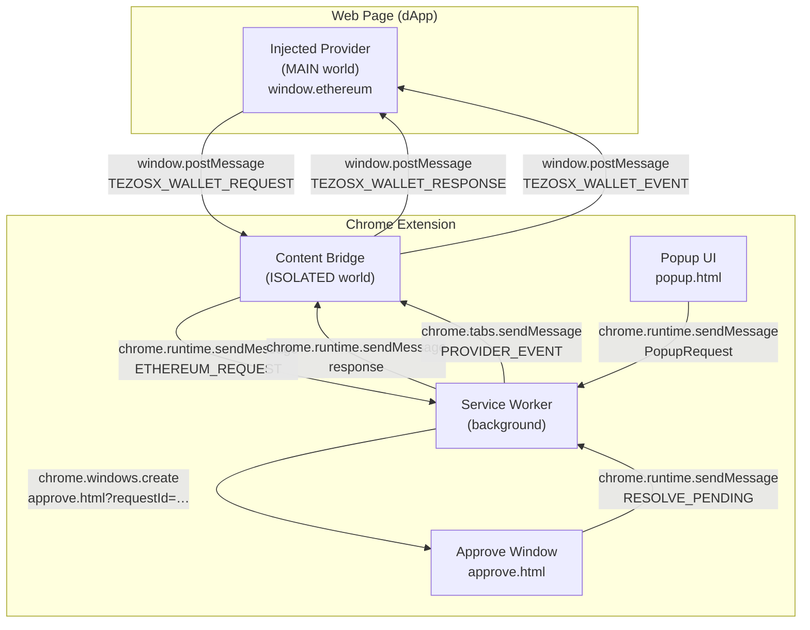
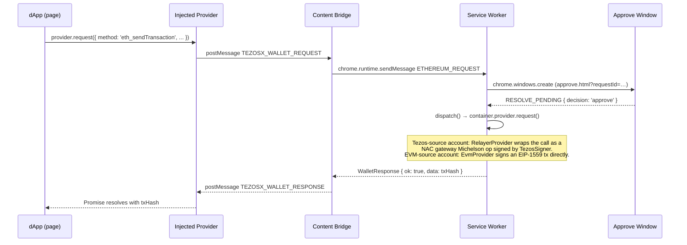

# Architecture Overview

TezosX Wallet is a Chrome Manifest V3 extension composed of four runtime components, each living in a different execution boundary. Most of the logic — keyring, use cases, message routing, container wiring — lives in the shared `@tezosx/wallet-core` package and is consumed unchanged by the mobile app; see [the four packages](./packages) for how the pieces fit together.

## Component diagram

## Components

### Injected Provider — MAIN world

**File**: [`packages/wallet/src/injected/provider.ts`](https://github.com/trilitech/tezos-x-wallet/blob/main/packages/wallet/src/injected/provider.ts)

Runs in the same JavaScript context as the web page. Exposes `window.ethereum` as a minimal EIP-1193 provider. Has **no access to `chrome.*` APIs** — it communicates exclusively via `window.postMessage`.

Every call to `provider.request()` is assigned a unique `requestId`, forwarded to the content bridge, and resolved or rejected when the bridge replies.

### Content Bridge — ISOLATED world

**File**: [`packages/wallet/src/content/bridge.ts`](https://github.com/trilitech/tezos-x-wallet/blob/main/packages/wallet/src/content/bridge.ts)

Runs in the extension's isolated world — it can see the page DOM but cannot access page globals. Bridges two channels:

- **Page → SW**: receives `TEZOSX_WALLET_REQUEST` postMessages, forwards them via `chrome.runtime.sendMessage`
- **SW → Page**: receives `PROVIDER_EVENT` push messages from the SW, relays them as `TEZOSX_WALLET_EVENT` postMessages

### Service Worker

**File**: [`packages/wallet/src/background/service-worker.ts`](https://github.com/trilitech/tezos-x-wallet/blob/main/packages/wallet/src/background/service-worker.ts)

The extension's backend. The service worker is a thin host shell: it builds the Chrome-specific adapters (vault / session / token stores, notifications, approval presenter, Web Crypto port), wires the auto-lock alarms, and delegates every incoming message to `dispatch()` in [`packages/core/src/composition/sw-wiring.ts`](https://github.com/trilitech/tezos-x-wallet/blob/main/packages/core/src/composition/sw-wiring.ts) — the routing table shared with the mobile app. The state that persists across popup opens:

- `Keyring` — the in-memory `UnlockedKeyring` (active account, decrypted vault payload, and the derived vault key — never the password, never a signing key). Handles AES-GCM vault encryption and the v2 → v3 upgrade-on-read described in [Keyring & Vault](./keyring).
- `Container` + `ContainerCache` — a per-account bundle `{ signer, provider, balanceFetcher, activitySources, crossRuntimeBuilder, … }` built by [`packages/core/src/composition/container.ts`](https://github.com/trilitech/tezos-x-wallet/blob/main/packages/core/src/composition/container.ts) with the adapter set matching the account's kind: Tezos accounts get `TezosSigner` + `RelayerProvider` + `TezosBalanceFetcher` (plus Michelson- and EVM-runtime activity fetchers); EVM-native accounts get `EvmSigner` + `EvmProvider` + `EvmBalanceFetcher`. Both kinds carry the cross-runtime builder for NAC precompile sends. Containers are cached in an in-memory LRU keyed by `accountId` (cleared on lock and service-worker death, evicted on account removal), so account switches are fast and a pending approval is served by the exact account it was pinned to.
- `ApprovalQueue` — pending dApp requests awaiting user consent (`connect`, `transaction`, `signature`).

Handles three message categories, routed by `dispatch()` to the matching use case under `packages/core/src/use-cases/`:

- **PopupRequest** — from the popup UI. The full verb list (from [`packages/core/src/shared/messages.ts`](https://github.com/trilitech/tezos-x-wallet/blob/main/packages/core/src/shared/messages.ts)): `GET_STATE`, `CREATE_WALLET`, `IMPORT_WALLET`, `IMPORT_SECRET_KEY`, `IMPORT_EVM_PRIVKEY`, `UNLOCK`, `LOCK`, `EXPORT_SEED`, `EXPORT_WALLET_SEED`, `SEND_TX`, `RESOLVE_TX`, `LIST_PENDING`, `LIST_SESSIONS`, `LIST_ACTIVITY`, `DISCONNECT`, `ADD_ACCOUNT`, `REMOVE_ACCOUNT`, `SET_ACTIVE_ACCOUNT`, `RENAME_ACCOUNT`, `LIST_ACCOUNTS`, `PEEK_CUSTOM_TOKEN`, `ADD_CUSTOM_TOKEN`, `REMOVE_CUSTOM_TOKEN`, `LIST_REGISTERED_TOKENS`.
- **ApproveRequest** — from `approve.html` (`GET_PENDING`, `RESOLVE_PENDING`)
- **EthereumRequest** — from the content bridge (dApp `provider.request()` calls). `eth_requestAccounts`, `eth_sendTransaction`, and `personal_sign` are gated by the approval queue; `eth_signTypedData*` is refused without prompting, because neither signer implements it.

`dispatch()` also enforces the sender guard: privileged messages (unlock, seed export, approval decisions) are accepted only from the extension's own trusted UI surfaces, and dApp traffic only from the content-script channel with a matching origin.

### Popup UI

**File**: [`packages/wallet/src/ui/`](https://github.com/trilitech/tezos-x-wallet/blob/main/packages/wallet/src/ui/)

A React + React Router app rendered in `popup.html`. Reads and mutates state exclusively via `chrome.runtime.sendMessage` to the service worker. Never touches the keyring or signer directly.

See [User Flows](../user-flows/create-wallet) for per-page documentation.

## Data flow — dApp transaction request

Wallet-initiated same-runtime XTZ sends (`tz1 → tz1`) never touch the gateway: the `sendTransfer` use case routes them through `TezosSigner.sendNativeTransfer()` as a plain Michelson operation.

## See also

- [The four packages](./packages) — `@tezosx/wallet-core`, the extension, the mobile app, and the relayer
- [Runtime Boundaries](./runtime-boundaries) — detailed MAIN vs ISOLATED world rules
- [Keyring](./keyring) — encryption and key derivation
- [dApp Bridge & Approval Queue](./dapp-bridge) — approval popup lifecycle
