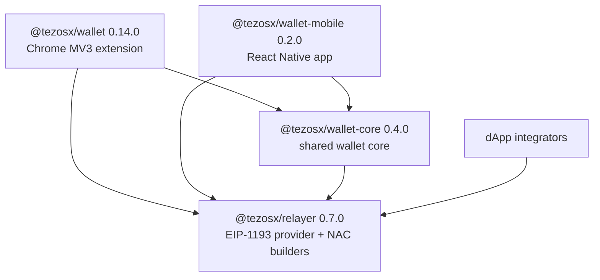

# The Four Packages

The monorepo ships four npm workspace packages. Two are user-facing shells (the Chrome extension and the mobile app), one is the shared wallet core they both consume, and one is the SDK that dApp integrators can use directly.

## `@tezosx/wallet-core` — the shared core

Where the wallet actually lives: `domain/` (pure types), `ports/` (interfaces), `use-cases/` (business operations), `adapters/` (Tezos/EVM implementations), `composition/` (container wiring and the message `dispatch`), plus the keyring, the approval queue, and the vault crypto under `background/` and `shared/`.

It is consumed **as raw TypeScript over the workspace** — its `package.json` exports `.ts` source files directly, and each shell's own build pipeline (Vite for the extension, Metro for mobile) compiles it. There is no separate build step and no published artifact.

## `@tezosx/wallet` — the Chrome extension shell

The Chrome MV3 shell: `chrome.*` adapters implementing the core's ports (vault, sessions, tokens, notifications), the service worker, the content-script/injected-provider pair, and the React popup/side-panel UI. Depends on core and on the relayer.

## `@tezosx/wallet-mobile` — the React Native shell

The iOS/Android shell (Expo dev build): MMKV storage adapters, the Keychain unlock-secret store, native crypto (`react-native-quick-crypto`), the WalletConnect transport, and the native UI. Depends on core and on the relayer. See the [mobile quickstart](../mobile/quickstart).

## `@tezosx/relayer` — the SDK

The EIP-1193 provider that lets a Tezos (`tz1`) signer drive EVM dApps on Tezos X, plus the NAC builders for both directions (the `/tezos` and `/evm` entry points). Consumed by the core (which wires it into every wallet Container) and directly by dApp integrators who bring their own Tezos signer.

## Versioning

Each package follows its own independent semver, tracked in its own `CHANGELOG.md` (`packages/<name>/CHANGELOG.md`). A wallet release that requires a core or relayer change bumps both packages and the dependency range in the same PR.
