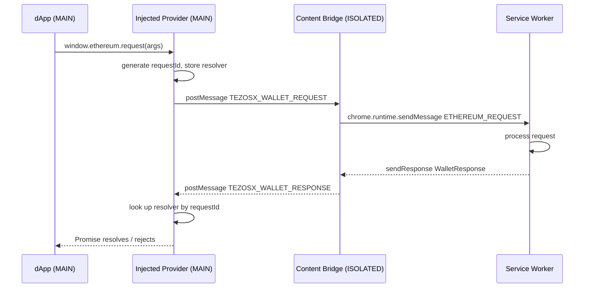

# Runtime Boundaries

Chrome extensions enforce strict separation between execution worlds. TezosX Wallet spans three of them.

## The three worlds

| World | Who runs there | Can access |
|---|---|---|
| **MAIN** | Page JS + injected provider | `window`, page globals. **No** `chrome.*` |
| **ISOLATED** | Content scripts | `window` (DOM only), `chrome.*`. **No** page globals |
| **Service Worker** | Background script | `chrome.*`, Node-like environment. **No** `window` |

## Why this matters

The injected provider must sit in the MAIN world so dApps can call `window.ethereum`. But it cannot call `chrome.runtime.sendMessage` to reach the service worker. The content bridge in the ISOLATED world bridges that gap.

## Communication channels

### MAIN ↔ ISOLATED: `window.postMessage`

The injected provider and the content bridge share the same `window` object. They communicate via structured messages with typed envelopes.

**Page → Bridge** (request):
```ts
// injected/provider.ts
window.postMessage(
  { type: 'TEZOSX_WALLET_REQUEST', requestId, args },
  window.location.origin || '*',
);
```

**Bridge → Page** (response):
```ts
// content/bridge.ts
window.postMessage(
  { type: 'TEZOSX_WALLET_RESPONSE', requestId, ok, result },
  window.location.origin || '*',
);
```

**Bridge → Page** (events):
```ts
window.postMessage(
  { type: 'TEZOSX_WALLET_EVENT', event: 'accountsChanged', data: accounts },
  window.location.origin || '*',
);
```

The bridge also relays the service worker's `WALLET_ROLE` push as a `TEZOSX_WALLET_ROLE` message on the same channel (see [dApp Bridge](./dapp-bridge#provider-identity--dapp-detection)).

All three message kinds pin `targetOrigin` to the page's own origin; the `|| '*'` fallback only applies on pages whose origin serializes as empty (opaque origins, e.g. sandboxed frames).

:::caution Origin check
Both ends — the injected provider and the content bridge — verify `event.source === window` before processing incoming messages, preventing other frames from spoofing requests or responses.
:::

### ISOLATED ↔ Service Worker: `chrome.runtime.sendMessage`

```ts
// content/bridge.ts
const response = await chrome.runtime.sendMessage({
  type: 'ETHEREUM_REQUEST',
  requestId,
  args,
  origin: window.location.origin,
});
```

The service worker registers `chrome.runtime.onMessage.addListener` and returns a promise-based response via the `sendResponse` callback with `return true` to keep the port open asynchronously.

### Service Worker → ISOLATED: `chrome.tabs.sendMessage`

Provider events (e.g. `accountsChanged` when the wallet locks) are pushed from the service worker to all tabs of connected origins:

```ts
// background/service-worker.ts
chrome.tabs.sendMessage(tab.id, {
  type: 'PROVIDER_EVENT',
  event: 'accountsChanged',
  data: [],
});
```

## Full round-trip sequence



## HMR caveat

Because the injected provider runs in the MAIN world, Vite's HMR cannot reload it without a full page reload. The CRXJS plugin emits a warning:

```
Content-script doesn't support HMR because the world is MAIN
```

This is expected. After a code change to `injected/provider.ts`, reload the extension at `chrome://extensions` and refresh the page.
