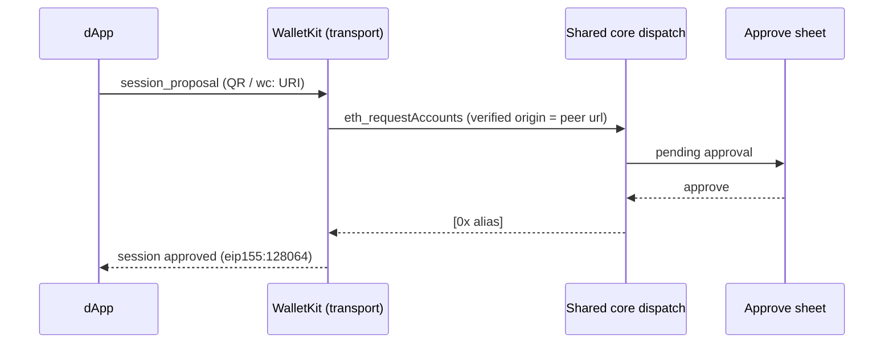

# WalletConnect

The mobile app has no injected `window.ethereum` — dApps connect over **WalletConnect v2** (Reown WalletKit). The transport is the mobile equivalent of the extension's content bridge: an incoming session proposal or request is routed through the same shared-core `dispatch` the extension's service worker uses, so approvals, session storage, and transaction routing behave identically on both surfaces.

## Pairing

The wallet must be **unlocked** before pairing — WalletConnect boots on unlock and restores previously approved sessions from its own storage, so a dApp connected before the app was closed reconnects when the wallet reopens.

Two ways to pair, both from the Connections screen:

1. **Scan the dApp's QR code** — a full-screen camera scanner (it asks for camera permission on open and ignores non-`wc:` QR codes).
2. **Paste the `wc:` URI** — the fallback when the camera is denied or the dApp runs on the same phone.

The incoming session proposal raises the in-app Approve sheet as an `eth_requestAccounts` request; approving derives the account's EVM alias, writes the per-origin session, and approves the WalletConnect session.

## What a session exposes

The approved namespace declares exactly one chain and two methods:

- **Chain**: `eip155:128064` — the Tezos X EVM runtime (previewnet). When a dApp does not request this chain, the wallet offers it directly rather than reconciling to nothing; a mainnet-only dApp then declines on its own side, which is correct — the wallet genuinely cannot serve other chains.
- **Methods**: `eth_accounts` and `eth_sendTransaction` — nothing else.
- **Events**: `accountsChanged` and `chainChanged`.

**Signing methods are not offered.** `personal_sign`, `eth_sign`, and `eth_signTypedData*` are excluded from the session namespace, and any such request that arrives anyway is rejected with EIP-1193 code **4200** at the request layer. A Tezos (`tz1`) account cannot produce an EVM message signature — its `0x` address is a kernel-derived alias with no wallet-held secp256k1 key — so offering these methods would be dishonest. When EVM-native accounts gain WalletConnect support, they become signable and can be advertised.

An `eth_sendTransaction` from a `tz1` account routes cross-runtime through the NAC gateway. The Approve sheet shows both the dApp's EVM intent and the Michelson gateway call that actually gets signed, gated by a per-signature biometric confirmation. The hash returned to the dApp is a synthetic one the public RPC never indexes — dApps should verify outcomes by re-reading state rather than by receipt lookup.

## Per-origin account binding

Each session is bound to the account that approved it. **Switching the active account does not re-point existing sessions** and tells connected dApps nothing — each dApp keeps addressing the account it connected with, and never learns about accounts that did not authorize it. Removing an account tears down only that account's sessions (the affected origin receives an empty `accountsChanged`).

## Disconnecting

- **From the wallet**: revoking a session on the Connections screen tears down the WalletConnect session (the dApp is notified) and clears the per-origin stored session that gates `eth_accounts`.
- **From the dApp**: a `session_delete` from the dApp triggers the same reconciliation, dropping the stored session. The reconciliation also runs at startup, so sessions revoked while the app was closed are cleaned up.

## Reference dApp: the playground

The repo ships a Next.js playground that exercises the full pairing flow — connect, chain id, balances, the Counter contract, native transfers. Set `NEXT_PUBLIC_WC_PROJECT_ID` in `playground/.env.local`, run `npm run dev`, pick "Tezos X Mobile (WalletConnect)" in the wallet list, and scan the QR from the app. See the [playground README](https://github.com/trilitech/tezos-x-wallet/blob/main/playground/README.md).

## See also

- [Quickstart](./quickstart) — the `EXPO_PUBLIC_WC_PROJECT_ID` setup
- [Security](./security) — the per-signature biometric confirmation
- [dApp Approval](../user-flows/dapp-approval) — the shared approval queue
