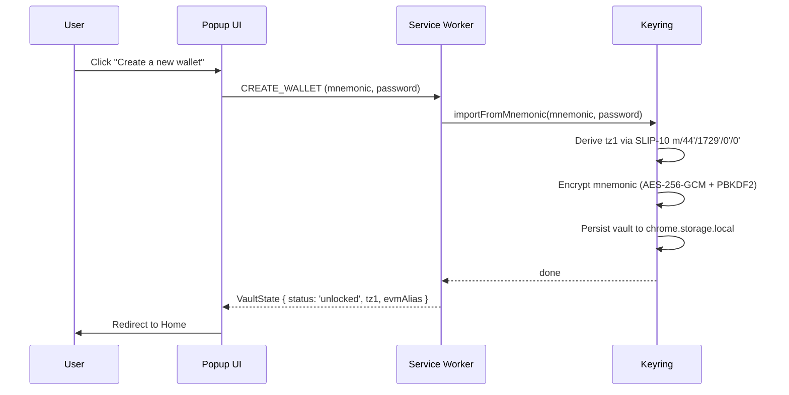

# Create a Wallet

The creation flow generates a fresh 24-word BIP-39 mnemonic, forces you to acknowledge you have saved it, then encrypts the vault with your chosen password.

## Flow overview

## Stage 1 — Seed phrase display

The wallet generates a 24-word BIP-39 mnemonic and displays it in a 3-column grid. A **Copy** button copies all 24 words to the clipboard.

:::danger Back up your seed phrase
Anyone with your 24 words can access your funds. Store them offline, in order, somewhere safe. The wallet has no recovery mechanism — if you lose your seed and forget your password, your funds are gone.
:::

Click **I have saved my seed phrase** to proceed to Stage 2.

## Stage 2 — Confirmation

A single checkbox and a "Next" button. You must acknowledge that:

- You have written down or securely stored the 24 words
- You understand there is no recovery option

This gate exists purely to force a moment of deliberate acknowledgement before encryption.

## Stage 3 — Set password

Enter and confirm a password (minimum 8 characters). This password:

- Is used as the KDF input for PBKDF2-SHA256 (200 000 iterations)
- Protects the vault stored in `chrome.storage.local`
- Is **never** stored anywhere — only used transiently to derive the encryption key

Click **Create wallet** to trigger `CREATE_WALLET` → `keyring.importFromMnemonic()`.

On success you are redirected to the [Home](./view-balances) screen.

## What happens internally

1. `keyring.create(password)` generates a 24-word English BIP-39 mnemonic via `@scure/bip39`
2. `importFromMnemonic(mnemonic, password)` runs:
   - Validate mnemonic against the English wordlist
   - Generate a random 32-byte salt and 12-byte IV
   - Derive a 256-bit key: `PBKDF2-SHA256(password, salt, 200 000 iterations)`
   - Encrypt the mnemonic: `AES-256-GCM(key, iv, mnemonic)`
   - Persist `{ salt, iv, ciphertext, iterations }` to `chrome.storage.local`
   - Derive the Tezos identity via SLIP-10 ed25519 on `m/44'/1729'/0'/0'`
   - Load `{ tz1, publicKey, secretKey }` into in-memory `UnlockedIdentity`
3. The service worker builds a `RelayerProvider` backed by the new `LocalSignerClient`
