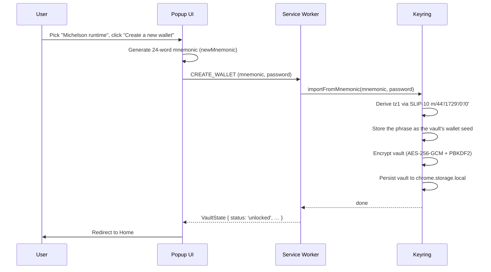

# Create a Wallet

Onboarding starts with a choice of account kind on the Welcome screen: a **Michelson runtime** account (`tz1`, backed by a BIP-39 recovery phrase) or an **EVM runtime** account (`0x`, backed by a secp256k1 private key). The creation flow then generates the corresponding secret, forces you to acknowledge you have saved it, and encrypts the vault with your chosen password.

## Flow overview (Tezos path)

## Tezos path — four stages

### Stage 1 — Acknowledgements

Before anything is generated, two checkboxes must be ticked: you will write the phrase down offline (the wallet cannot restore it), and you understand anyone with the phrase can move your funds.

### Stage 2 — Recovery phrase

The wallet generates a fresh **24-word** English BIP-39 mnemonic (256-bit entropy, via `newMnemonic()` in `packages/core/src/shared/seed.ts`) and displays it in a numbered grid, blurred until you tap to reveal. There is no copy button here — the phrase is meant to be written down offline.

An info note on this screen states an important scope caveat: **this phrase restores every account you create in this wallet, but a Tezos secret key or EVM private key you import later is not derived from it** — back those up separately.

:::danger Back up your recovery phrase
Anyone with your 24 words can access your funds. Store them offline, in order, somewhere safe. The wallet has no recovery mechanism — if you lose your phrase and forget your password, your funds are gone.
:::

### Stage 3 — Confirmation

The wallet asks you to type the words at three randomly chosen positions. All three must match before you can continue. This gate exists purely to force a moment of deliberate verification before encryption.

### Stage 4 — Set password

Enter and confirm a password (minimum 8 characters). This password:

- Is the KDF input for PBKDF2-SHA256 (**600 000 iterations**)
- Protects the vault stored in `chrome.storage.local`
- Is **never** stored anywhere — only used transiently to derive the encryption key

Click **Open wallet** to trigger `CREATE_WALLET` → `keyring.importFromMnemonic()`.

On success you are redirected to the [Home](./view-balances) screen.

## EVM path

Picking **EVM runtime** on the Welcome screen runs the mirror flow in `CreateEvm`:

1. **Acknowledgements** — the same two checkboxes, phrased for a private key.
2. **Private key** — the wallet generates a fresh random 32-byte secp256k1 private key and shows it (64 hex characters, `0x`-prefixed) alongside the derived EVM address, blurred until revealed. Reveal, Hide, and Copy controls are provided.
3. **Confirm backup** — a checkbox acknowledging the key is stored offline. The wallet won't show it again until you reveal it from [Settings](./settings).
4. **Set password** — identical to the Tezos path. Submission goes through `IMPORT_EVM_PRIVKEY`.

An EVM-native account has a single `0x` address and no recovery phrase of its own — the private key *is* the backup. A vault created this way holds no wallet seed, so the derived-account cards described in [Multi-account vaults](./multi-account) don't appear until you add a phrase-backed account.

## What happens internally (Tezos path)

1. The popup generates the 24-word English BIP-39 mnemonic via `@scure/bip39` and keeps it in memory across the reveal/confirm stages.
2. The service worker's `createAccount` use case calls `keyring.importFromMnemonic(mnemonic, password)` (the keyring's `create()` method is a thin wrapper that generates a mnemonic and calls the same function):
   - Validate the mnemonic against the English wordlist
   - Derive the Tezos identity via SLIP-10 ed25519 on `m/44'/1729'/0'/0'` — HD index 0, the same path the earlier single-account wallet used, so addresses are unchanged
   - Store the phrase as the vault's **wallet seed**: later "Add account" derives the next per-curve index from this phrase instead of minting a new one (see [Multi-account vaults](./multi-account))
   - Generate a random **16-byte salt** and 12-byte IV
   - Derive a 256-bit key: `PBKDF2-SHA256(password, salt, 600 000 iterations)`
   - Encrypt the vault payload (version 3): `AES-256-GCM(key, iv, payload)`
   - Persist `{ salt, iv, ciphertext, iterations }` to `chrome.storage.local`
3. The service worker builds the account's container (signer, provider, fetchers) and the popup lands on Home, unlocked.

The keyring lives in `packages/core/src/background/keyring.ts`; the vault envelope in `packages/core/src/shared/vault-crypto.ts`.

## See also

- [Import a Wallet](./import-wallet) — restore from a phrase, an `edsk…` key, or an EVM private key
- [Multi-account vaults](./multi-account) — derive more accounts from the same phrase
- [Security model](../technical/security-model) — vault encryption, auto-lock, unlock throttle
