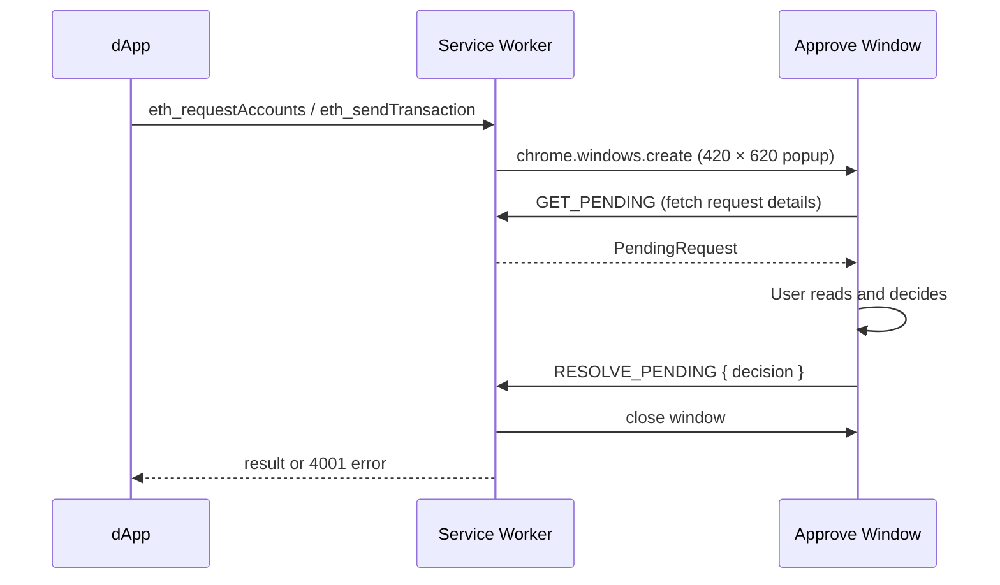

# dApp Approval

When a dApp requests your accounts or asks you to sign a transaction, TezosX Wallet opens a dedicated **approval window** for your consent. No dApp action is taken until you explicitly approve.

## When approvals are triggered

| dApp call | Approval type |
|---|---|
| `eth_requestAccounts` | Connection request |
| `eth_sendTransaction` | Transaction request |
| All other methods | Pass-through (no approval needed) |

## Connection request

A site calling `eth_requestAccounts` is asking for permission to know your EVM address.

The approval window shows:

- **Origin** — the requesting site's hostname (e.g. `app.uniswap.org`)
- **What it gets** — your EVM alias (`0x…`); never your seed phrase or secret key
- **Approve / Reject** buttons

If you approve, the wallet:
1. Stores a `StoredSession` (origin, tz1, evmAlias, chainId, connectedAt) in `chrome.storage.local`
2. Returns `[evmAlias]` to the dApp

If you reject, the dApp receives an EIP-1193 error `4001 — User rejected the request`.

## Transaction request

A site calling `eth_sendTransaction` is asking you to sign and broadcast a transaction.

The approval window shows two cards stacked vertically:

**dApp intent** — what the page asked for:

- **To** — destination address as the dApp specified
- **Value** — amount in wei
- **Data** — raw hex calldata (if any)

**What you actually sign** (present only for Tezos-source accounts, since 0.11.0) — the resolved Michelson call your `tz1` will commit to:

- **Michelson target** — the NAC gateway `KT1…` your op targets
- **Entrypoint** — `call` for bare value transfers (the generic HTTP `%call`), `call_evm` for ABI calls
- **Selector** — the 4-byte function selector, present only when the entrypoint is `call_evm`. Resolved against a curated allow-list; unknown selectors are rejected by the relayer before the popup opens
- **Debit (mutez)** — the actual mutez amount that will move from your `tz1`. Wei amounts not divisible by 10¹² (1 mutez) are rejected upstream; what you see here is exact

The two cards let you verify the dApp's stated intent matches what the kernel will actually execute. EVM-source accounts skip the second card — they sign the EVM tx directly with no cross-runtime translation.

- **Method** — decoded method signature if resolvable (e.g. `transfer(address,uint256)`)
- **Approve / Reject** buttons

If you approve, the wallet signs the L1 operation via `LocalSignerClient` and returns the synthetic transaction hash to the dApp.

### Session gating

Since 0.11.0, signature methods (`eth_sendTransaction`, `personal_sign`, `eth_signTypedData_v4`) require an active session for the calling origin — the page must have completed `eth_requestAccounts` first. Calls from unconnected tabs receive EIP-1193 error `4100` (unauthorised) directly, with no popup. This matches the standard EIP-1193 contract; the Connect step is no longer cosmetic.

### Auto-recovery when the service worker session is lost

Manifest V3 evicts the wallet's service worker on idle (no message activity for a few minutes) or when it sits behind a long blocking call (e.g. a cross-runtime sign + resolve sequence that takes 30 s). On wake, the SW has lost its in-memory unlock cache: `keyring.getUnlocked()` returns `null` and any popup operation other than `GET_STATE` / `UNLOCK` will respond with `4100` "Wallet is locked", even though the popup's React state may still think the user is unlocked.

Since 0.11.1, the popup detects this case at the messaging layer ([`shared/messaging.ts`](https://github.com/trilitech/tezos-x-wallet/blob/main/packages/wallet/src/shared/messaging.ts), `SW_SESSION_LOST_EVENT`): on `4100` from any non-exempt request, a DOM event fires. The app's top-level `Gate` listens, re-runs `GET_STATE`, sees the SW-side state is now `locked`, and routes the user to `/unlock`. The user enters their password once and lands back at a working session — no need to lock + unlock manually.

This is purely a UX improvement; the security model is unchanged (the keyring is genuinely re-derived from the password on every SW boot).

## Approval window lifecycle

The approval window is a separate Chrome popup (not the extension popup). It has its own URL (`approve.html?requestId=…`) and is closed automatically after the decision.

## Toolbar badge — pending request counter

Since 0.6.0, the toolbar icon displays a badge with the **count of pending approvals** so you don't miss one if you switched tabs:

- A new `eth_requestAccounts` or `eth_sendTransaction` triggers the badge to show `1` (or `N` if several queue up).
- The badge is cleared as soon as you approve, reject, or close an approval window.
- The badge is also cleared on lock and on service-worker restart, so a stale "1" can never outlive the actual queue.

Implementation lives in `lib/badge.ts` (`setPendingBadge(count)` / `clearPendingBadge()`); the colour (`var(--tx-purple)` ≈ `#a78bfa`) is centralised in `BADGE_BG_COLOR` so the badge stays visually consistent with the rest of the wallet design.

## What if I close the window?

Closing the approval window with the Chrome × button is treated as an explicit **reject**. The wallet listens to `chrome.windows.onRemoved` and resolves the pending request with `4001 — User rejected the request`, so the dApp's promise never hangs and the badge decrements correctly.

:::caution Pending requests on lock
Locking the wallet also rejects every pending approval (`rejectAll()`); each waiting dApp receives `4001 — User rejected the request`.
:::
