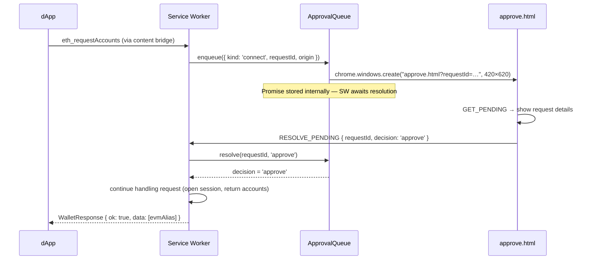

# dApp Bridge & Approval Queue

When a dApp calls `eth_requestAccounts` or `eth_sendTransaction`, the wallet cannot proceed silently — it must show the user a consent screen. The `ApprovalQueue` ([`packages/wallet/src/background/approval-queue.ts`](https://github.com/trilitech/tezos-x-wallet/blob/main/packages/wallet/src/background/approval-queue.ts)) manages this flow.

## Two request types

| Kind | Triggered by | Shown in approve window |
|---|---|---|
| `connect` | `eth_requestAccounts` | Site origin + permission summary |
| `transaction` | `eth_sendTransaction` | Destination, value, calldata, method signature |

## Approval flow



If the user closes the window without deciding, the promise is rejected when `rejectAll()` is called (e.g. on lock).

## `enqueue()` internals

```ts
async enqueue(request: PendingRequest): Promise<'approve' | 'reject'> {
  return new Promise((resolve) => {
    const win = chrome.windows.create({
      url: `approve.html?requestId=${request.requestId}`,
      type: 'popup', width: 420, height: 620,
    });
    this.pending.set(request.requestId, { request, resolve, windowId: win.id });
  });
}
```

The `resolve` function is stored alongside the request. When `approve.html` calls `RESOLVE_PENDING`, the service worker calls `queue.resolve(requestId, decision)`, which fires the stored resolve and unblocks the awaiting handler.

## `rejectAll()` on lock

When the wallet locks, all pending approvals are immediately rejected:

```ts
// service-worker.ts — LOCK handler
keyring.lock();
provider = null;
queue.rejectAll('wallet locked');
```

Any dApp awaiting a response receives an EIP-1193 error `4001 — User rejected the request`.

## `approve.html` — the consent window

`approve.html` is listed under `web_accessible_resources` in the manifest so Chrome can load it as a standalone popup window (not inside the extension popup frame).

It reads the `requestId` query parameter, calls `GET_PENDING` to fetch the request details from the service worker, and renders either:

- **Connection request**: origin hostname, permission description, Approve / Reject buttons
- **Transaction request**: destination address, value in XTZ, calldata hex, method signature (if resolved from the 4byte registry), Approve / Reject buttons

The window is automatically closed by the service worker after `RESOLVE_PENDING` is handled.
