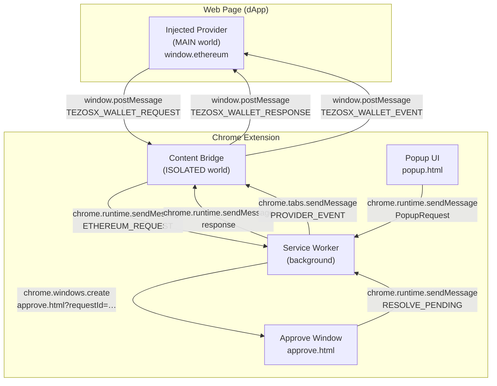
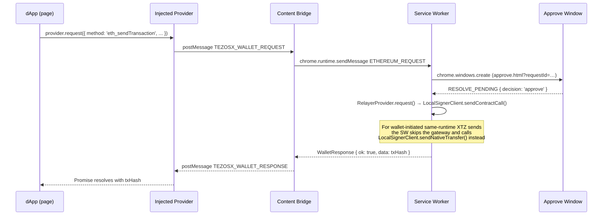

# Architecture Overview

TezosX Wallet is a Chrome Manifest V3 extension composed of four runtime components, each living in a different execution boundary.

## Component diagram

## Components

### Injected Provider — MAIN world

**File**: [`packages/wallet/src/injected/provider.ts`](https://github.com/trilitech/tezos-x-wallet/blob/main/packages/wallet/src/injected/provider.ts)

Runs in the same JavaScript context as the web page. Exposes `window.ethereum` as a minimal EIP-1193 provider. Has **no access to `chrome.*` APIs** — it communicates exclusively via `window.postMessage`.

Every call to `provider.request()` is assigned a unique `requestId`, forwarded to the content bridge, and resolved or rejected when the bridge replies.

### Content Bridge — ISOLATED world

**File**: [`packages/wallet/src/content/bridge.ts`](https://github.com/trilitech/tezos-x-wallet/blob/main/packages/wallet/src/content/bridge.ts)

Runs in the extension's isolated world — it can see the page DOM but cannot access page globals. Bridges two channels:

- **Page → SW**: receives `TEZOSX_WALLET_REQUEST` postMessages, forwards them via `chrome.runtime.sendMessage`
- **SW → Page**: receives `PROVIDER_EVENT` push messages from the SW, relays them as `TEZOSX_WALLET_EVENT` postMessages

### Service Worker

**File**: [`packages/wallet/src/background/service-worker.ts`](https://github.com/trilitech/tezos-x-wallet/blob/main/packages/wallet/src/background/service-worker.ts)

The extension's backend. Since version 0.7.0 the service worker is intentionally thin (~95 lines) — it instantiates the long-lived state and delegates every incoming message to `composition/sw-wiring.ts`'s `dispatch()`. The state that persists across popup opens:

- `Keyring` — in-memory `UnlockedSession` (the active `Account` plus its decoded secret key). Handles AES-GCM vault encryption and the V1 → V2 upgrade-on-read described in [Keyring & Vault](./keyring).
- `Container` — a freshly built `{ signer, provider, balanceFetcher, vaultStore, sessionStore, notifications }` rebuilt on every unlock by [`composition/container.ts`](https://github.com/trilitech/tezos-x-wallet/blob/main/packages/wallet/src/composition/container.ts), with the adapter set wired to the active account's kind. Tezos accounts get `TezosSigner` + `RelayerProvider` + `TezosBalanceFetcher`; EVM-native accounts get `EvmSigner` + `EvmProvider` + `EvmBalanceFetcher` (plus the NAC precompile builder for cross-runtime sends).
- `ApprovalQueue` — pending dApp requests awaiting user consent (`connect`, `transaction`, `signature`).

Handles three message categories, routed by `dispatch()` to the matching use case under `src/use-cases/`:

- **PopupRequest** — from the popup UI (`UNLOCK`, `LOCK`, `CREATE_WALLET`, `IMPORT_WALLET`, `IMPORT_SECRET_KEY`, `IMPORT_EVM_PRIVKEY`, `SEND_TX`, `RESOLVE_TX`, `LIST_SESSIONS`, `DISCONNECT`, etc.)
- **ApproveRequest** — from `approve.html` (`GET_PENDING`, `RESOLVE_PENDING`)
- **EthereumRequest** — from the content bridge (dApp's `provider.request()` calls). `eth_requestAccounts`, `eth_sendTransaction`, `personal_sign`, and `eth_signTypedData_v4` are gated by the approval queue.

### Popup UI

**File**: [`packages/wallet/src/ui/`](https://github.com/trilitech/tezos-x-wallet/blob/main/packages/wallet/src/ui/)

A React + React Router app rendered in `popup.html`. Reads and mutates state exclusively via `chrome.runtime.sendMessage` to the service worker. Never touches the keyring or signer directly.

See [User Flows](../user-flows/create-wallet) for per-page documentation.

## Data flow — dApp transaction request

## See also

- [Runtime Boundaries](./runtime-boundaries) — detailed MAIN vs ISOLATED world rules
- [Keyring](./keyring) — encryption and key derivation
- [dApp Bridge & Approval Queue](./dapp-bridge) — approval popup lifecycle
