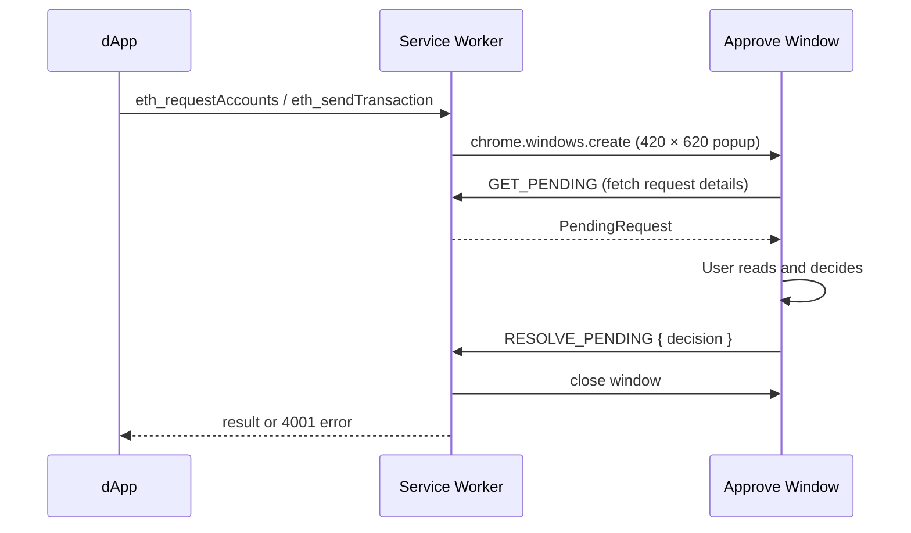

# dApp Approval

When a dApp requests your accounts or asks you to sign a transaction, TezosX Wallet opens a dedicated **approval window** for your consent. No dApp action is taken until you explicitly approve.

## When approvals are triggered

| dApp call | Approval type |
|---|---|
| `eth_requestAccounts` | Connection request |
| `eth_sendTransaction` | Transaction request |
| All other methods | Pass-through (no approval needed) |

## Connection request

A site calling `eth_requestAccounts` is asking for permission to know your EVM address.

The approval window shows:

- **Origin** — the requesting site's hostname (e.g. `app.uniswap.org`)
- **What it gets** — your EVM alias (`0x…`); never your seed phrase or secret key
- **Approve / Reject** buttons

If you approve, the wallet:
1. Stores a `StoredSession` (origin, tz1, evmAlias, chainId, connectedAt) in `chrome.storage.local`
2. Returns `[evmAlias]` to the dApp

If you reject, the dApp receives an EIP-1193 error `4001 — User rejected the request`.

## Transaction request

A site calling `eth_sendTransaction` is asking you to sign and broadcast a transaction.

The approval window shows:

- **Origin** — the requesting site
- **To** — destination address
- **Value** — amount in XTZ
- **Data** — raw hex calldata (if any)
- **Method** — decoded method signature if resolvable (e.g. `transfer(address,uint256)`)
- **Approve / Reject** buttons

If you approve, the wallet signs the L1 operation via `LocalSignerClient` and returns the synthetic transaction hash to the dApp.

## Approval window lifecycle

The approval window is a separate Chrome popup (not the extension popup). It has its own URL (`approve.html?requestId=…`) and is closed automatically after the decision.

## Toolbar badge — pending request counter

Since 0.6.0, the toolbar icon displays a badge with the **count of pending approvals** so you don't miss one if you switched tabs:

- A new `eth_requestAccounts` or `eth_sendTransaction` triggers the badge to show `1` (or `N` if several queue up).
- The badge is cleared as soon as you approve, reject, or close an approval window.
- The badge is also cleared on lock and on service-worker restart, so a stale "1" can never outlive the actual queue.

Implementation lives in `lib/badge.ts` (`setPendingBadge(count)` / `clearPendingBadge()`); the colour (`var(--tx-purple)` ≈ `#a78bfa`) is centralised in `BADGE_BG_COLOR` so the badge stays visually consistent with the rest of the wallet design.

## What if I close the window?

Closing the approval window with the Chrome × button is treated as an explicit **reject**. The wallet listens to `chrome.windows.onRemoved` and resolves the pending request with `4001 — User rejected the request`, so the dApp's promise never hangs and the badge decrements correctly.

:::caution Pending requests on lock
Locking the wallet also rejects every pending approval (`rejectAll()`); each waiting dApp receives `4001 — User rejected the request`.
:::
